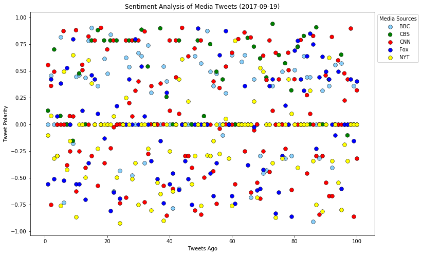
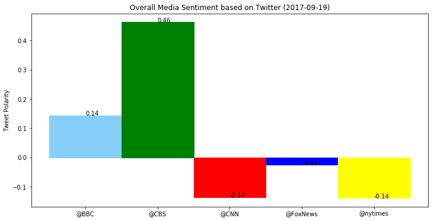

```python
import tweepy
import json
import numpy as np
import pandas as pd
import matplotlib.pyplot as plt
from datetime import datetime

from vaderSentiment.vaderSentiment import SentimentIntensityAnalyzer
analyzer = SentimentIntensityAnalyzer()

consumer_key = "Ed4RNulN1lp7AbOooHa9STCoU"
consumer_secret = "P7cUJlmJZq0VaCY0Jg7COliwQqzK0qYEyUF9Y0idx4ujb3ZlW5"
access_token = "839621358724198402-dzdOsx2WWHrSuBwyNUiqSEnTivHozAZ"
access_token_secret = "dCZ80uNRbFDjxdU2EckmNiSckdoATach6Q8zb7YYYE5ER"

auth = tweepy.OAuthHandler(consumer_key, consumer_secret)
auth.set_access_token(access_token, access_token_secret)
api = tweepy.API(auth, parser=tweepy.parsers.JSONParser())

```


```python
search_term = ("@BBC", "@CBS", "@CNN","@FoxNews", "@nytimes")

rows=[]

for term in search_term:    
    print("> Extracting tweets for: "+term)
    for pg in range(5):  
        public_tweets = api.user_timeline(term, page=pg+1)            
        ctr=1
        for tweet in public_tweets:       
            print(">>> Reading Tweet: "+str(ctr)+" Of Page: "+str(pg+1))
            print(tweet["text"])
            #print(json.dumps(tweet, indent = 2, separators=(',', ': ')))            
            ctr+=1            
            compound = analyzer.polarity_scores(tweet["text"])["compound"]
            positive = analyzer.polarity_scores(tweet["text"])["pos"]            
            neutral = analyzer.polarity_scores(tweet["text"])["neu"]
            negative = analyzer.polarity_scores(tweet["text"])["neg"]   
            txt=tweet["text"]
            dttm=datetime.strptime(tweet["created_at"] , '%a %b %d %H:%M:%S %z %Y')
            
            rows.append((term,txt,dttm,0,compound,positive,neutral,negative))        
    
sentim_df=pd.DataFrame(rows, columns=["Media Source","Tweet","DateTime","Tweets Ago","Compound", "Positive", "Neutral", "Negative"])

```

    > Extracting tweets for: @BBC
    >>> Reading Tweet: 1 Of Page: 1
    America's opioid addiction, as explained by @ChelseaClinton. Via @BBC_Future. https://t.co/p3fxsiSeu0
    >>> Reading Tweet: 2 Of Page: 1
    They're back! French and Saunders will reunite for a Christmas special. 🎉 https://t.co/IkyTI9EFUB https://t.co/vkjFueBzyP
    >>> Reading Tweet: 3 Of Page: 1
    Astonishingly, some people still need to be told not to eat raw chicken. 🙅🐔 https://t.co/nnjrCmsAfH https://t.co/qLQClQRmri
    >>> Reading Tweet: 4 Of Page: 1
    'How are you in my house if you've never seen Lord of the Rings?' 😂 Via @BBCTheSocial. https://t.co/ApmQ1Q4Hrt
    >>> Reading Tweet: 5 Of Page: 1
    "I don't sit and knit." 👵 🎉 A woman celebrating her 111th birthday says having fun keeps her feeling young.… https://t.co/s2ZBJcf0UM
    >>> Reading Tweet: 6 Of Page: 1
    RT @BBCTwo: WARNING: This clip contains graphic scenes of outrageous ankle-kissing... 😳 #Quacks https://t.co/PLlPgzqMvX
    >>> Reading Tweet: 7 Of Page: 1
    RT @bbc5live: Look at this picture... @HenryFraser0, who is paralysed from the shoulders down, painted it with his mouth.
    
    His story with @…
    >>> Reading Tweet: 8 Of Page: 1
    RT @bbcworldservice: It's time to widen the lens and focus on black women behind the camera according to African American photographer Layl…
    >>> Reading Tweet: 9 Of Page: 1
    RT @BBCTheOneShow: #Birmingham bin workers have been on strike for 10weeks. Are these guys undermining the strike or being helpful? Let us…
    >>> Reading Tweet: 10 Of Page: 1
    RT @bbcstories: 'It's OK to make mayonnaise while on your period' - the scoutmaster on a mission to bust menstruation myths in Madagascar h…
    >>> Reading Tweet: 11 Of Page: 1
    📻 'Birds fly to the moon.' Strange &amp; delightful theories of bird migration by academics of the 1680s. 👉… https://t.co/VdCCsIRG1E
    >>> Reading Tweet: 12 Of Page: 1
    RT @BBC_Teach: Is this an archive clip I see before me?! Watch these contrasting treatments of Macbeth from 1958 and 2016👇👑#BBCSchools60 ht…
    >>> Reading Tweet: 13 Of Page: 1
    🚨 New #DoctorWho fan fiction challenge! Write a story where the Doctor gets an unexpected call. ☎… https://t.co/oa1CbKRbIq
    >>> Reading Tweet: 14 Of Page: 1
    RT @BBCR1: So, this is perfect 💜
    
    @WolfAliceMusic cover @GreenDay's Good Riddance for #R1LiveLoungeMonth https://t.co/GQ52fVq4Wn
    >>> Reading Tweet: 15 Of Page: 1
    RT @BBCR1: YES @wolfalicemusic 👏
    
    Beautifully Unconventional sounds great in the Live Lounge 💥
    
    #R1LiveLoungeMonth https://t.co/LgzoPVCWgZ
    >>> Reading Tweet: 16 Of Page: 1
    RT @bbcthree: Four years since @BBCSimonMcCoy used a pack of A4 paper instead of an iPad. https://t.co/XI0cyuqU1L
    >>> Reading Tweet: 17 Of Page: 1
    RT @BBCTheOneShow: Veteran Stuart on importance of the #invictusgames for recovery from injuries sustained in Afghanistan @weareinvictus #T…
    >>> Reading Tweet: 18 Of Page: 1
    RT @BBCNewsEnts: French and Saunders are back!
    https://t.co/hyAscMoP9N
    >>> Reading Tweet: 19 Of Page: 1
    🏝💿 Surprising, insightful &amp; entertaining #DesertIslandDiscs admissions from the silver screen’s biggest names. 👉… https://t.co/ZiLSPmP6nt
    >>> Reading Tweet: 20 Of Page: 1
    RT @bbcworldservice: Electric cars were more popular in the late 1800s than gasoline vehicles, especially with women. 📻 https://t.co/v3H364…
    >>> Reading Tweet: 1 Of Page: 2
    RT @bbcpress: 🕰 #AntiquesRoadshow celebrates its 40th anniversary. Interviews, top finds, fascinating facts and more: https://t.co/EkplgRsx…
    >>> Reading Tweet: 2 Of Page: 2
    Benedict Cumberbatch has everything going for him. Yet the Sherlock star says he's his own worst critic.… https://t.co/kaVYCKywVU
    >>> Reading Tweet: 3 Of Page: 2
    See how @ILMLondon bring an alien to life with new facial &amp; performance capture technology. Via @BBCClick. https://t.co/CHaXkjeVbc
    >>> Reading Tweet: 4 Of Page: 2
    No harm done - but this little koala might stick to the trees from now on after hitching a 16km ride on a car axle.… https://t.co/0mTp0l24Ta
    >>> Reading Tweet: 5 Of Page: 2
    🎧 @AChrisEvans gave #Morrissey's brand new track #SpentTheDayInBed a spin this morning. Listen here.👉… https://t.co/9gEHtfjwor
    >>> Reading Tweet: 6 Of Page: 2
    RT @bbccomedy: Can the awesome cast of #UpstartCrow guess the real Shakespeare from the Fakespeare? @WhelanGemma @spendals @noelfielding11…
    >>> Reading Tweet: 7 Of Page: 2
    RT @BBCArchive: Arrrr, me hearties! It's #InternationalTalkLikeAPirateDay so ye better be followin' arr handy guide... #internationalspeakl…
    >>> Reading Tweet: 8 Of Page: 2
    Schizophrenia does not mean you have a split personality. Have we all been getting the wrong impression?… https://t.co/j558qdERyY
    >>> Reading Tweet: 9 Of Page: 2
    RT @BBCRadio3: Did you know Magnolia trees evolved before bees or butterflies? 
    https://t.co/qtZA77pzTD https://t.co/XDLhRMPr9J
    >>> Reading Tweet: 10 Of Page: 2
    RT @bbcasiannetwork: Here's the moment @CraigDavid filled @HarpreetUK in on his love of Bhangra!
    👂 to the full interview: https://t.co/4BEw…
    >>> Reading Tweet: 11 Of Page: 2
    RT @bbcworldservice: One of nature's greatest art works has been given a make-over. https://t.co/0AUuPGgMSz 📻 https://t.co/AwgcPD6MsU
    >>> Reading Tweet: 12 Of Page: 2
    RT @BBCScotland: "there's absolutely no road here, nothing..." The walk to Strathchailleach bothy #BothyLife on @BBCiPlayer - https://t.co/…
    >>> Reading Tweet: 13 Of Page: 2
    'So fit &amp; so good! See their hands?' The reactions from these tribespeople seeing Morris dancing for the first time… https://t.co/c3RwitYnVG
    >>> Reading Tweet: 14 Of Page: 2
    📻 Scientists have discovered that tattoo ink enters the bloodstream and travels to vital organs. 😬… https://t.co/XbVsZ2ik9d
    >>> Reading Tweet: 15 Of Page: 2
    🎼 A 13-year-old harp prodigy has become one of the youngest associate members of the Royal Schools of Music &amp;… https://t.co/lBgoEbVeFa
    >>> Reading Tweet: 16 Of Page: 2
    🎥🎞 How Magnum Photos told the story of cinema. https://t.co/dyvfIPYHlL https://t.co/SNpVSo0rSJ
    >>> Reading Tweet: 17 Of Page: 2
    'Nobody watches TV anymore. So let’s find more ways of doing less of it better.' 🙃 #W1A returns at 10pm on @BBCTwo.… https://t.co/fzl3YXIJg3
    >>> Reading Tweet: 18 Of Page: 2
    Exciting news! @MichaelSheen and #DavidTennant have begun filming for #GoodOmens, coming soon to @BBCTwo. 🎬… https://t.co/uMgJHGeGnx
    >>> Reading Tweet: 19 Of Page: 2
    🎶 @BBCRadio2 to host a spectacular soul, funk &amp; disco party on Saturday 30 September at @O2ApolloManc. 👉… https://t.co/4fpTf4p4VH
    >>> Reading Tweet: 20 Of Page: 2
    😋🍫 Now you can be a master chocolatier! Via @BBCFood. https://t.co/IDg5T81KS0
    >>> Reading Tweet: 1 Of Page: 3
    Angry swan, 'arrested' by police following 'road rage' incident. 😂 https://t.co/fQBCOhiq8F https://t.co/RJQ4k6JJos
    >>> Reading Tweet: 2 Of Page: 3
    Andy Murray: 'Tennis women make the same sacrifices as men.' 🎾 https://t.co/V0ja8rwr5R https://t.co/NAWSC5NDJV
    >>> Reading Tweet: 3 Of Page: 3
    🦍 Cincinnati Zoo has introduced its first new gorilla since the death of Harambe in 2016. https://t.co/nUfeUHoBEf https://t.co/eTqyz63gXI
    >>> Reading Tweet: 4 Of Page: 3
    RT @bbcwritersroom: Screenwriter Stephen Butchard on adapting Ian McEwan's The Child in Time for @BBCOne starring #BenedictCumberbatch http…
    >>> Reading Tweet: 5 Of Page: 3
    RT @BBCSpringwatch: Why have so many Portuguese man-of-war washed up on Cornwall's beaches? Read more from @BBCCornwall 👉🏽 https://t.co/pJY…
    >>> Reading Tweet: 6 Of Page: 3
    When you've worked in customer service WAY too long… 😂 Via @BBCTheSocial. https://t.co/0rbOynj0fz
    >>> Reading Tweet: 7 Of Page: 3
    Cast an eye over the best-dressed stars at this year's #Emmys in LA. 👀 https://t.co/4CdOzdUzPg https://t.co/DawdnozKzb
    >>> Reading Tweet: 8 Of Page: 3
    RT @BBCR1: "The fans are so cool." 
    
    @MileyCyrus chats to @ClaraAmfo about her love for the UK 💛✨
    
    Watch the full interview 👉 https://t.co/…
    >>> Reading Tweet: 9 Of Page: 3
    RT @bbccomedy: New #W1A tonight, 10pm @BBCTwo! In the mean time, writer and director John Morton blogs about the new series 👉 https://t.co/…
    >>> Reading Tweet: 10 Of Page: 3
    RT @bbcmusic: 🎉 Celebrate 25 years of @BBCLater on @BBCiPlayer
    We delve into the shows archives to bring you the A-Z of Later
    👉https://t.co…
    >>> Reading Tweet: 11 Of Page: 3
    RT @CBeebiesHQ: John Humphrys as you've never seen him before! 😳
    
    Can he keep @GoJetters' Ubercorn in check? 🦄
    
    🙌 🚀 🌎
    
    @MastermindQuiz
    
    @BB…
    >>> Reading Tweet: 12 Of Page: 3
    🥁🎸 Handwritten notes &amp; heartfelt posts. Here are 7 heartwarming letters sent from fans to their music heroes. 👉… https://t.co/p0W59Am5bb
    >>> Reading Tweet: 13 Of Page: 3
    RT @BBCR1: That VOICE 😍
    
    So good to have @RitaOra perform Your Song in the Live Lounge 💫
    
    Listen here 👉 https://t.co/48RuyAdouO https://t.c…
    >>> Reading Tweet: 14 Of Page: 3
    RT @BBCR1: WOAH 💖
    
    @RitaOra pays homage to musical icon @Madonna with her take on Like A Virgin ✨
    
    #R1LiveLoungeMonth https://t.co/ET7vltwn…
    >>> Reading Tweet: 15 Of Page: 3
    🎬 A quick rundown of the #Emmys nominees &amp; winners in the major categories. 👉 https://t.co/5qjL9OuCao https://t.co/oL0jeA126H
    >>> Reading Tweet: 16 Of Page: 3
    Two new murals by Banksy have appeared in central London. 🎨 https://t.co/EWfzMYls4d https://t.co/s9w8sJRdON
    >>> Reading Tweet: 17 Of Page: 3
    RT @bbcthree: This riddle will reveal if you have a gender bias. https://t.co/4EniYl2xJM
    >>> Reading Tweet: 18 Of Page: 3
    What a way to pop the question! A man in Devon surprised his girlfriend by ploughing his proposal into a field. 💕🚜🌳… https://t.co/CQlHapCiVu
    >>> Reading Tweet: 19 Of Page: 3
    RT @BBC_Teach: Did you know Sun 24 September marks 60 years of BBC Schools? Which programmes do you remember from school? Let us know using…
    >>> Reading Tweet: 20 Of Page: 3
    'I have kleptomania but when it gets bad I take something for it.' 😂
    Are these the best comedy one-liners ever told… https://t.co/ZBoDvI3v4S
    >>> Reading Tweet: 1 Of Page: 4
    RT @bbccomedy: It's 26 years this week since Bottom first aired! Saluting @AdrianEdmondson and the much-missed Rik Mayall ❤️ GAS MAN! GAS M…
    >>> Reading Tweet: 2 Of Page: 4
    19-year-old Swiss skier @AndriRagettli shows off his parkour skills during a training session. Via @BBCNewsbeat. ⛷ https://t.co/qcBpeWDVCZ
    >>> Reading Tweet: 3 Of Page: 4
    RT @BBCR1: Who's ready for @RitaOra in the Live Lounge? ✨
    
    Make sure you're listening at 12pm 👉 https://t.co/48RuyzVNDg
    
    #R1LiveLoungeMonth…
    >>> Reading Tweet: 4 Of Page: 4
    RT @AboutTheBBC: "Nothing worthwhile is easy" - John Morton, writer and director of #W1A and #TwentyTwelve blogs about the new series https…
    >>> Reading Tweet: 5 Of Page: 4
    RT @bbcpress: 🎬 First look at David Tennant and @MichaelSheen in @BBCTwo's #GoodOmens as filming begins: https://t.co/DnJWYqJaZf https://t.…
    >>> Reading Tweet: 6 Of Page: 4
    'It's been a hell of a journey to get to this point.'
    #BattleToTheStartLine, now on @BBCiPlayer.… https://t.co/ELGufLIUHv
    >>> Reading Tweet: 7 Of Page: 4
    How Hull became Britain's hotbed of ballet talent. 🙆🎵 https://t.co/RT1Z6o4EP9 https://t.co/yvSllDdXw9
    >>> Reading Tweet: 8 Of Page: 4
    Where does the world of Gilbert &amp; George end, and where does the real world begin? https://t.co/X3eiTBwyjf https://t.co/XTJc17yO6Y
    >>> Reading Tweet: 9 Of Page: 4
    RT @BBCNewsbeat: Donald Glover (aka Childish Gambino) made history at the #Emmys last night. https://t.co/eYH5DrxARb https://t.co/SR9AeC2Rho
    >>> Reading Tweet: 10 Of Page: 4
    🌱 The mystery of the lost Roman herb. It used to be worth its weight in gold – but no one knows if it still exists.… https://t.co/DXdwXUTwMo
    >>> Reading Tweet: 11 Of Page: 4
    RT @BBCRadio3: 🐝 🌳 🎶 For those of you that love the idea of music and nature but don't have a great deal of time to spare.
    https://t.co/Hkz…
    >>> Reading Tweet: 12 Of Page: 4
    RT @BBCEngland: Two murals by street artist Banksy have appeared in central London https://t.co/8gWBZYCQef https://t.co/6jwoTKMqUz
    >>> Reading Tweet: 13 Of Page: 4
    RT @bbcdoctorwho: Ready to embark on another week?
    #MondayMotivation #DoctorWho https://t.co/iE33olwL7X
    >>> Reading Tweet: 14 Of Page: 4
    RT @BBCLondonNews: Two murals by street artist Banksy have appeared in central London https://t.co/6Eo3zHNPLE https://t.co/u10j1TLANn
    >>> Reading Tweet: 15 Of Page: 4
    RT @bbcthesocial: Have ye ever been to HoolieKrankie?
    
    (via @BBCScotland)
    https://t.co/qgWJsf8mb7
    >>> Reading Tweet: 16 Of Page: 4
    RT @BBCOne: 🎉🎉Good news!🎉🎉
    We're pleased to announce #Strike will return to @BBCOne​ next year with #CareerOfEvil. 🙌 https://t.co/xLSICWAmz2
    >>> Reading Tweet: 17 Of Page: 4
    Every year, more than 1,000 lives are lost on Peru's mountain roads. 🏔🚍 Via @BBCEarth. https://t.co/HM2MmKWvvl
    >>> Reading Tweet: 18 Of Page: 4
    Plants perceive the world without eyes, ears or brains. Understanding how can teach us a lot about them. 🌼🌿… https://t.co/CimLDQhmWQ
    >>> Reading Tweet: 19 Of Page: 4
    Love, loss and every parent's worst nightmare. 💔 #TheChildInTime, starring Benedict Cumberbatch, coming soon to… https://t.co/dBZbxUdxFj
    >>> Reading Tweet: 20 Of Page: 4
    ❤️️ Meet the inspirational #InvictusGames competitors on #BattleToTheStartLine. 7:35pm @BBCOne. @KensingtonRoyal.… https://t.co/TENNVywu1d
    >>> Reading Tweet: 1 Of Page: 5
    🍲⏰ Super speedy suppers that won't disappoint on the flavour front. 👉 https://t.co/VCM39TWthv https://t.co/iGibqbYePL
    >>> Reading Tweet: 2 Of Page: 5
    In the Yukon’s remote mountains is evidence of the Earth’s tumultuous climate swings from millions of years ago. 🏔… https://t.co/KJWFZrjiEx
    >>> Reading Tweet: 3 Of Page: 5
    'The happiest years I've ever spent were those working in the Women's Land Army.' 💪👭 Via @BBC5Live. https://t.co/6YJLgCdczy
    >>> Reading Tweet: 4 Of Page: 5
    Why are we willing to pay for bottled water when we can get it out of the tap for free? 🚰 https://t.co/kgqFsC9BJO https://t.co/hXnSTDC60K
    >>> Reading Tweet: 5 Of Page: 5
    💍 Tying the knot changes our personalities for better &amp; for worse... https://t.co/Zd91A4jxhC https://t.co/kKSc19PNSZ
    >>> Reading Tweet: 6 Of Page: 5
    The woman highlighting New Zealand's devastating suicide problem with hundreds of pairs of shoes. ❤️️👟 Via… https://t.co/RKCwFQO3gM
    >>> Reading Tweet: 7 Of Page: 5
    🌳🥇 An oak with royal connections &amp; a mulberry at the centre of a legend are up for the title of Tree of the Year.… https://t.co/HTMtgU0j0G
    >>> Reading Tweet: 8 Of Page: 5
    Jim Carrey calls NY Fashion Week 'meaningless' in bizarre interview. 
    https://t.co/pGJqjNwiUY https://t.co/OQcuHgAWS0
    >>> Reading Tweet: 9 Of Page: 5
    Introducing Samantha, a robot with a human-like brain and the ability to 'feel emotion'. 🤖 💕 https://t.co/VuEwDBgDGh https://t.co/DwlKyINmZf
    >>> Reading Tweet: 10 Of Page: 5
    🔥🏌Because nothing stands in the way of the 18th hole. https://t.co/2LI00ZAKpg https://t.co/B4wDXMmoaL
    >>> Reading Tweet: 11 Of Page: 5
    Do animals smile? 🐵😃 Via @BBCNewsbeat. https://t.co/aPCjhLYU8v
    >>> Reading Tweet: 12 Of Page: 5
    The problem for the world’s most expensive spice. 🔥 https://t.co/ee9i4REECD https://t.co/uPq1l8fKFj
    >>> Reading Tweet: 13 Of Page: 5
    Gifs seem brightly millennial – so it might come as a surprise that the they actually turned 30 this year. 🎈… https://t.co/dJtgbyPOxl
    >>> Reading Tweet: 14 Of Page: 5
    📝 Seven of your biggest grammar bugbears sorted. 👉 https://t.co/L1jyOMTvCO https://t.co/mVM1klwQRQ
    >>> Reading Tweet: 15 Of Page: 5
    RT @BBCArchive: #OTD 1948: Hard-as-nails men, in skirts, throwing tree trunks? It can only be the Braemar Games, which celebrated its Royal…
    >>> Reading Tweet: 16 Of Page: 5
    RT @BBCMOTD: What a weekend of #PremierLeague action we've had so far! 🙌 
    
    Watch #MOTD2 Extra @BBCTwo &amp; @5liveSport 12:15 BST. https://t.co…
    >>> Reading Tweet: 17 Of Page: 5
    RT @bbcgetinspired: Coach💪
    Kit collector💪
    Volunteer💪
    
    Let @campbelldarren tell you all about nominating your #BBCUnsungHero https://t.co/yj…
    >>> Reading Tweet: 18 Of Page: 5
    🌩💦 Why do storms have names and who gets to decide them? https://t.co/SiGfkdl3We https://t.co/1FYOfYvfs5
    >>> Reading Tweet: 19 Of Page: 5
    What reefs should look like. 🦈🐠🦐 
    #TribesPredatorsAndMe via @BBCEarth &amp; @BBCTwo. https://t.co/cMiuqniCef
    >>> Reading Tweet: 20 Of Page: 5
    Cheeselog? Chisel Bob? Chuggy pig? What do you call woodlice? This map reveals how the answer differs across the UK… https://t.co/qq0upjaG1k
    > Extracting tweets for: @CBS
    >>> Reading Tweet: 1 Of Page: 1
    RT @startrekcbs: Snap to transport yourself to another world. Unlock the exclusive #StarTrekDiscovery @Snapchat lens now: https://t.co/BNGl…
    >>> Reading Tweet: 2 Of Page: 1
    RT @MeMyselfAndICBS: Any advice for your younger self? @bibbymoynihan asks @wbtourhollywood visitors this question! Share yours with #Advic…
    >>> Reading Tweet: 3 Of Page: 1
    Screenwriter and actress @LenaWaithe made history at this year's #Emmys. Watch her powerful acceptance speech:… https://t.co/ZeHM4gKQ5G
    >>> Reading Tweet: 4 Of Page: 1
    Check out the photos of some behind-the-scenes moments you may have missed from TV's biggest night:… https://t.co/IyMJEOUZfQ
    >>> Reading Tweet: 5 Of Page: 1
    RT @9JKLCBS: #9JKL is based on some of @markfeuerstein's most awkward family moments. What are yours? Share your stories with #MyAwkwardFam…
    >>> Reading Tweet: 6 Of Page: 1
    Relive all the excitement and find out who won big at the 69th Emmy® Awards. See the full list of winners:… https://t.co/lGBOjealgU
    >>> Reading Tweet: 7 Of Page: 1
    See the biggest names in television light up the #Emmys red carpet: https://t.co/5yaM4UF4KX #ICYMI https://t.co/4qh6onq8OF
    >>> Reading Tweet: 8 Of Page: 1
    Host Stephen Colbert blew the audience away with his opening number at the #Emmys. Watch the full clip:… https://t.co/Rv3NwjJuKZ
    >>> Reading Tweet: 9 Of Page: 1
    Did you miss television's biggest night? Catch up on the #Emmys now: https://t.co/EMxWKauzMb https://t.co/2Y71gw7Jr7
    >>> Reading Tweet: 10 Of Page: 1
    Catch up on all the entertaining speeches and big wins from the most glamorous night on TV. Watch the #Emmys now:… https://t.co/FRoKq9OFTs
    >>> Reading Tweet: 11 Of Page: 1
    Who took home a golden statuette? See the complete list of winners from the #Emmys: https://t.co/W9VduVc9lp https://t.co/d5FqBXDhtn
    >>> Reading Tweet: 12 Of Page: 1
    A complete showcase of Stephen Colbert's funniest moments from the #Emmys: https://t.co/L1vnRQw4Ri https://t.co/f9RHVgC2Kc
    >>> Reading Tweet: 13 Of Page: 1
    RT @colbertlateshow: Stephen starts to glitch while hosting the #Emmys &amp; needs to be evaluated... in the nude. Watch the full diagnosis: ht…
    >>> Reading Tweet: 14 Of Page: 1
    That’s a wrap! Congratulations to all #Emmy winners! https://t.co/Pi8ASpHYK5
    >>> Reading Tweet: 15 Of Page: 1
    RT @TheEmmys: Congrats #ElizabethMoss on your Primetime #Emmy  Award for #TheHandmaidsTale https://t.co/T13uVadatj
    >>> Reading Tweet: 16 Of Page: 1
    RT @TheEmmys: Congrats @SterlingKBrown on your Primetime #Emmy Award for #ThisIsUs https://t.co/wv5Y3rBOkG
    >>> Reading Tweet: 17 Of Page: 1
    RT @TheEmmys: Congrats #BiglittleLies on your Primetime #Emmy  Award for Best Limited Series #womenasheroes https://t.co/198e4IJYnt
    >>> Reading Tweet: 18 Of Page: 1
    RT @TheEmmys: Congrats @blackmirror on your Primetime #Emmy  Award for Best Television Movie #LoveWillWin https://t.co/Hyxtws5v8O
    >>> Reading Tweet: 19 Of Page: 1
    RT @TheEmmys: Congrats #nicolekidman on your Primetime #Emmy  Award for #BigLittleLies https://t.co/VTfs8OSoC8
    >>> Reading Tweet: 20 Of Page: 1
    S.W.A.T. star @ShemarMoore lights up the red carpet with a smile. See all the glamorous #Emmys looks:… https://t.co/MPPQk2QVOn
    >>> Reading Tweet: 1 Of Page: 2
    RT @TheEmmys: Congrats @rizmc on your Primetime #Emmy  Award for #TheNightof https://t.co/OUYAASicfe
    >>> Reading Tweet: 2 Of Page: 2
    RT @TheEmmys: Congrats @VeepHBO on your Primetime #Emmy  Award https://t.co/XL6IuF8HlF
    >>> Reading Tweet: 3 Of Page: 2
    RT @TheEmmys: Congrats @OfficialJLD on your Primetime #Emmy  Award for #Veep @VeepHBO https://t.co/HigOeXXyzz
    >>> Reading Tweet: 4 Of Page: 2
    Classic CBS stars, Norman Lear and Carol Burnett made an appearance tonight at the #Emmys! https://t.co/lkQp6uKMyg
    >>> Reading Tweet: 5 Of Page: 2
    CBS star @AllisonBJanney looks ravishing in white at the #Emmys. See all the best-dressed stars on the red carpet:… https://t.co/BFzxtrrjhx
    >>> Reading Tweet: 6 Of Page: 2
    RT @TheEmmys: Congrats @donaldglover on your Primetime #Emmy  Award for @AtlantaFX #Atlanta https://t.co/LAYFF77Rvb
    >>> Reading Tweet: 7 Of Page: 2
    RT @TheEmmys: Congrats @iamjohnoliver on your Primetime #Emmy  Award for #LastWeekTonight https://t.co/HeusvOdGHW
    >>> Reading Tweet: 8 Of Page: 2
    RT @TheEmmys: Congrats #DonRoyKing on your Primetime #Emmy  Award for #Saturdaynightlive https://t.co/O73irJuSq3
    >>> Reading Tweet: 9 Of Page: 2
    RT @TheEmmys: Congrats @CharlieBrooker on your Primetime #Emmy Award for #BlackMirror https://t.co/iViGEfr0ya
    >>> Reading Tweet: 10 Of Page: 2
    RT @TheEmmys: Congrats @reedmorano on your Primetime #Emmy  Award for #TheHandmaidsTale #FemaleDirectors https://t.co/yvacXuYnA3
    >>> Reading Tweet: 11 Of Page: 2
    From dreams to reality. Congratulations @LenaWaithe and @azizansari on your Primetime #Emmy Award! https://t.co/TaSQsiIhRs
    >>> Reading Tweet: 12 Of Page: 2
    If you liked @markfeuerstein at the #Emmys, you'll love him in the new comedy coming this fall, @9JKLCBS! https://t.co/7Kt9tE57DJ
    >>> Reading Tweet: 13 Of Page: 2
    Sheldon x 2 = Adorable! #Emmys @IainLoveTheatre https://t.co/loABr28IgD
    >>> Reading Tweet: 14 Of Page: 2
    Sean Spicer appears to confirm largest #Emmys audience ever, period. Watch the star's reactions:… https://t.co/l0x4NiCJsO
    >>> Reading Tweet: 15 Of Page: 2
    Come on, it's @Oprah! https://t.co/vgTlY6qzGE
    >>> Reading Tweet: 16 Of Page: 2
    CBS' own @SonequaMG and @jeremypiven are quite a duo as presenters at the #Emmys! https://t.co/ufxH7380cS
    >>> Reading Tweet: 17 Of Page: 2
    RT @TheEmmys: Congrats #AlexanderSkarsgard on your Primetime #Emmy Award for #BigLittleLies "thank u for making me feel like one of the gir…
    >>> Reading Tweet: 18 Of Page: 2
    RT @SuperiorDonuts: Does the voice of the #Emmys sound familiar? Watch them live now on @CBS &amp; CBS All Access: https://t.co/4LDe6vCybL #Sup…
    >>> Reading Tweet: 19 Of Page: 2
    Don't miss all of the sketches and dresses and speeches and more! Watch the #Emmys LIVE on CBS and CBS All Access!… https://t.co/0RgtVcsoIT
    >>> Reading Tweet: 20 Of Page: 2
    RT @TheEmmys: Congrats #jeanmarcvallee on your Primetime #Emmy  Award for #BigLittleLies https://t.co/O9b32ehkal
    >>> Reading Tweet: 1 Of Page: 3
    RT @colbertlateshow: Are you watching what @SeanSpicer confirmed is the largest #Emmys ever, period? What are you waiting for? https://t.co…
    >>> Reading Tweet: 2 Of Page: 3
    RT @TheEmmys: Congrats @AlecBaldwin on your Primetime #Emmy  Award for #Saturdaynightlive https://t.co/VurSzGMjA5
    >>> Reading Tweet: 3 Of Page: 3
    RT @TheEmmys: Congrats #brucemiller on your Primetime #Emmy Award for #HandmaidsTale https://t.co/xmosDAyQ2V
    >>> Reading Tweet: 4 Of Page: 3
    RT @TheEmmys: Congrats @nbcsnl on your Primetime #Emmy Award for Best #VarietySketch Series https://t.co/DYhkh2NxNN
    >>> Reading Tweet: 5 Of Page: 3
    When the #Emmys asks you to take your clothes off on TV. https://t.co/O26aHapn1d
    >>> Reading Tweet: 6 Of Page: 3
    Congratulations, Donald Glover! #Emmys https://t.co/uFV9A9xo6g
    >>> Reading Tweet: 7 Of Page: 3
    The #Emmys where we finish each other's....sentences! https://t.co/sOAlMCu3A9
    >>> Reading Tweet: 8 Of Page: 3
    RT @TheEmmys: Congrats #Lauradern 4 Primetime #Emmy #BigLittleLies "I've been acting since I was 11 yrs old and I've worked with, like 12 w…
    >>> Reading Tweet: 9 Of Page: 3
    RT @TheEmmys: Congrats #katemckinnon on your Primetime #Emmy  Award for #snl https://t.co/kXXQvODuRl
    >>> Reading Tweet: 10 Of Page: 3
    RT @TheEmmys: Congrats @JohnLithgow on your Primetime #Emmy Award for #TheCrown https://t.co/CZoAEz8aBg
    >>> Reading Tweet: 11 Of Page: 3
    RT @colbertlateshow: Here's the moment @StephenAtHome walked offstage after that epic opening number and monologue at the #Emmys. https://t…
    >>> Reading Tweet: 12 Of Page: 3
    Spotted: @shemarmoore from @swatcbs looking sharp! #Emmys https://t.co/vIOp7IAswH
    >>> Reading Tweet: 13 Of Page: 3
    This is how you do a happy dance #Emmys! Who are you excited to see tonight? https://t.co/T1P2OmBY9e
    >>> Reading Tweet: 14 Of Page: 3
    Everyone's losing their marbles at the #Emmys ! https://t.co/v6zMytSfAV
    >>> Reading Tweet: 15 Of Page: 3
    Everything is better on TV! #Emmys
    >>> Reading Tweet: 16 Of Page: 3
    Don’t miss the 69th Emmy® Awards – streaming LIVE now on CBS &amp; CBS All Access: https://t.co/whuCPMC3Er #Emmys https://t.co/o2cy3lFA84
    >>> Reading Tweet: 17 Of Page: 3
    Thank you cam, hosted interviews, photo lounge &amp; more! See the #Emmys action behind-the-scenes with Backstage Live:… https://t.co/mzxgPGcwh4
    >>> Reading Tweet: 18 Of Page: 3
    RT @colbertlateshow: Sneak peek at where @StephenAtHome will spend much of his time hosting tonight's #Emmys. What do you think of this inc…
    >>> Reading Tweet: 19 Of Page: 3
    The stars have arrived! ⭐️ Watch the #Emmys red carpet LIVE on Facebook with @etnow's @leanneaguilera here:… https://t.co/3JGXokwGik
    >>> Reading Tweet: 20 Of Page: 3
    Television’s greatest night has arrived! Watch the #Emmys tonight at 8 PM ET / 5 PM PT on CBS and CBS All Access:… https://t.co/0fKy11rhoF
    >>> Reading Tweet: 1 Of Page: 4
    Stream the #Emmys red carpet LIVE today with @etnow's @leanneaguilera on the CBS Facebook page. Details:… https://t.co/DmBLxofpIE
    >>> Reading Tweet: 2 Of Page: 4
    Get ready for football! Stream NFL on CBS today w/ #CBSAllAccess. Try 1 week FREE! (Not available on mobile phones)… https://t.co/vag5N9BfvH
    >>> Reading Tweet: 3 Of Page: 4
    Tonight's the night! Here's everything you need to know about the #Emmys: https://t.co/LYH1GYoK1i https://t.co/XMrAXwkZ10
    >>> Reading Tweet: 4 Of Page: 4
    RT @colbertlateshow: The most important part of any #Emmys rehearsal... practicing how to make @Oprah your best friend. (Yep. I'm coming fo…
    >>> Reading Tweet: 5 Of Page: 4
    The stars come out tomorrow! ⭐ Stream the Emmy® Awards LIVE on CBS All Access. Start your FREE trial now:… https://t.co/NfmUwcs3gV
    >>> Reading Tweet: 6 Of Page: 4
    Relive all the spectacular performances in honor of country’s icons. All the greatest moments from the #ACMHonors:… https://t.co/tvmtXaksE0
    >>> Reading Tweet: 7 Of Page: 4
    Find out how the 69th Emmy® Awards' hopefuls go from nominees to winners: https://t.co/bSm06K2EkQ #Emmys https://t.co/5UdTJWXbs3
    >>> Reading Tweet: 8 Of Page: 4
    Stream the #Emmys red carpet tomorrow LIVE with @etnow's @leanneaguilera on the CBS Facebook page. Details:… https://t.co/tghgzhFVVB
    >>> Reading Tweet: 9 Of Page: 4
    Stream #23 Tennessee @ #24 Florida LIVE today at 3:30PM ET with a FREE trial of #CBSAllAccess:… https://t.co/PQfcWMC2bo
    >>> Reading Tweet: 10 Of Page: 4
    And the winner is... Don't miss the #Emmys, hosted by Stephen Colbert, live tomorrow on CBS and CBS All Access:… https://t.co/p2mvqn0Zdh
    >>> Reading Tweet: 11 Of Page: 4
    Catch up on all the stunning performances and memorable speeches at the #ACMHonors! Watch the full special:… https://t.co/CBaNmI5VL6
    >>> Reading Tweet: 12 Of Page: 4
    Find out who performed special tributes to country's biggest stars. All the greatest moments from the #ACMHonors:… https://t.co/jjmYOQGZF0
    >>> Reading Tweet: 13 Of Page: 4
    RT @avacbell: WOW! @GeorgeStrait still sounds so amazing live!! A true American country legend! #ACMHonors #countrymusic #Nashville
    >>> Reading Tweet: 14 Of Page: 4
    What a night! Congratulations to all of the #ACMHonors recipients! https://t.co/f6cucRx4DD
    >>> Reading Tweet: 15 Of Page: 4
    RT @danaraenc: Chris Stapleton singing a George Strait song… Yes please! #ACMHonors ❤️🎼🎤
    >>> Reading Tweet: 16 Of Page: 4
    Here comes the ACM Vocal Group of the Year, @LittleBigTown! #ACMHonors https://t.co/BxZFi8svMA
    >>> Reading Tweet: 17 Of Page: 4
    RT @GingerSnaps: This Glen Campbell tribute on the #ACMHonors is perfection. #chills
    >>> Reading Tweet: 18 Of Page: 4
    RT @Purpletenn: Love seeing the artists in the audience, singing along to the artists on stage! ❤️ #ACMHonors
    >>> Reading Tweet: 19 Of Page: 4
    ACM Male Vocalist of the Year, @ThomasRhett sure knows how to captivate a crowd. #ACMHonors https://t.co/PNvSEe39Vz
    >>> Reading Tweet: 20 Of Page: 4
    RT @DollyParton: It's all true 😉
    
    #ACMHonors https://t.co/4IPN93ldDl
    >>> Reading Tweet: 1 Of Page: 5
    The Queen of Nashville, @dollyparton, has given the world so much more than music. Thank you for your generosity, D… https://t.co/FRuxzPVwC0
    >>> Reading Tweet: 2 Of Page: 5
    The legend, @BradPaisley honoring @dollyparton! So much talent packed onto the stage tonight! #ACMHonors https://t.co/mF7LQZu2FU
    >>> Reading Tweet: 3 Of Page: 5
    Congratulations @KelseaBallerini for receiving the Gene Weed Milestone Award! #ACMHonors https://t.co/D3rBxteQFa
    >>> Reading Tweet: 4 Of Page: 5
    RT @Momof3princess: My kids are laughing at me but I am singing right along #ACMHonors https://t.co/kSAoPXEqZQ
    >>> Reading Tweet: 5 Of Page: 5
    Toby Keith is bringing us back to 1993 with his debut single, “Should’ve Been a Cowboy!” #ACMHonors https://t.co/64kLnJQZoq
    >>> Reading Tweet: 6 Of Page: 5
    Congratulations, @Reba for receiving the Mae Boren Axton Service Award! #ACMHonors https://t.co/sI6bGXziAb
    >>> Reading Tweet: 7 Of Page: 5
    RT @GOPatterson: YES @HillaryScottLA AND @KarenFairchild HONORING @reba 🙌🏽❤️🙌🏽 #ACMHonors This is Heaven !!
    >>> Reading Tweet: 8 Of Page: 5
    .@HillaryScottLA, @KarenFairchild and @ohgussie are serenading @Reba with her own hits! 🎶
    #ACMHonors https://t.co/5OA0lspNn0
    >>> Reading Tweet: 9 Of Page: 5
    RT @RussellMadison_: Time for #ACMHonors !
    >>> Reading Tweet: 10 Of Page: 5
    Don’t miss out on an evening with country music’s biggest stars, the 11th Annual ACM Honors begins soon! #ACMHonors https://t.co/LECt13Hloa
    >>> Reading Tweet: 11 Of Page: 5
    Tonight, get ready for a country celebration! Watch the #ACMHonors @ 9/8c on CBS, or stream it with CBS All Access:… https://t.co/U76gWo1mEG
    >>> Reading Tweet: 12 Of Page: 5
    RT @CBSBigBrother: Paul, Christmas, &amp; Josh begin the battle to win the $500,000 grand prize tonight at 8/7c on #BB19: https://t.co/uudtMeMR…
    >>> Reading Tweet: 13 Of Page: 5
    RT @TheTalkCBS: Even our ladies know that as hosts, sometimes you have to bare it all - just ask #Emmys host @StephenAtHome https://t.co/3Y…
    >>> Reading Tweet: 14 Of Page: 5
    RT @SEALTeamCBS: See how #SEALTeam's heroic German Shepherd—DITA the Hair Missile—spends her days on set! 🐕📷: https://t.co/hoqjTFrtbC https…
    >>> Reading Tweet: 15 Of Page: 5
    The #Emmys are streaming LIVE on CBS All Access this Sun, Sept. 17 at 8pm ET/5pm PT! Start your FREE trial now:… https://t.co/Y2mkqLZPkb
    >>> Reading Tweet: 16 Of Page: 5
    RT @startrekcbs: Welcome aboard the bridge of the U.S.S. Discovery. Stream the #StarTrekDiscovery world premiere Sept 24: https://t.co/acwP…
    >>> Reading Tweet: 17 Of Page: 5
    Country star @MarenMorris explains what it means to pay tribute to @GlenCampbell at the #ACMHonors, tonight @ 9/8c… https://t.co/TUqG4KYt9E
    >>> Reading Tweet: 18 Of Page: 5
    Who did Stephen Colbert call when he found out @colbertlateshow was nominated? The #Emmys are Sun @ 8pm ET/5pm PT o… https://t.co/abVGKfsAaa
    >>> Reading Tweet: 19 Of Page: 5
    Tonight, Nashville salutes country icons @GeorgeStrait, @DollyParton, @Reba &amp; more! Watch the #ACMHonors at 9/8c on… https://t.co/5IdeQWOPHB
    >>> Reading Tweet: 20 Of Page: 5
    RT @startrekcbs: We embrace the unknown. Stream the world premiere of #StarTrekDiscovery Sept 24 on CBS All Access: https://t.co/H4LOVFv6DX…
    > Extracting tweets for: @CNN
    >>> Reading Tweet: 1 Of Page: 1
    Norway's giant pension fund is now worth over $1 trillion. Yes, 1 followed by 12 zeros. https://t.co/XjGvdWMo87 https://t.co/ngi5nu2ijl
    >>> Reading Tweet: 2 Of Page: 1
    Glass breaks off a building after a 7.1-magnitude earthquake struck Mexico City, killing more than 100 people… https://t.co/xUKrc0JBzH
    >>> Reading Tweet: 3 Of Page: 1
    How Republicans senators say they'll vote on the Graham-Cassidy health care bill https://t.co/HQO71SuSgs https://t.co/l8gVDLeHwI
    >>> Reading Tweet: 4 Of Page: 1
    RT @CNNTonight: Democrat @RepSwalwell: Almost everyone on Trump team has not been forthcoming when describing contacts with Russians https:…
    >>> Reading Tweet: 5 Of Page: 1
    After Russian Facebook ads, Democrats seek new Federal Election Commission rules on social media politics… https://t.co/yOcMWWHuQH
    >>> Reading Tweet: 6 Of Page: 1
    RT @AC360: Democrat Rep Himes: Mueller may be trying to "turn" Manafort to testify against other people https://t.co/Z6YuX8O3ey
    >>> Reading Tweet: 7 Of Page: 1
    Germany's car industry has a tough new critic: Chancellor Angela Merkel https://t.co/gyf5DpcVuu https://t.co/k2kUJd0n1j
    >>> Reading Tweet: 8 Of Page: 1
    Bed Bath &amp; Beyond shares plunge after disappointing earnings report https://t.co/cznszMMgkk https://t.co/2NiPEpars7
    >>> Reading Tweet: 9 Of Page: 1
    Biden calls out review of Obama-era Title IX guidance, cites "new challenges" in combating campus sexual assault… https://t.co/whBI5IjKkl
    >>> Reading Tweet: 10 Of Page: 1
    Gov. Ricardo Rosselló: Conditions deteriorating; We're expecting "worst hurricane in modern history in Puerto Rico" https://t.co/t5Zizd3XE0
    >>> Reading Tweet: 11 Of Page: 1
    Hours after a drill in Mexico City commemorating a 1985 earthquake, the real thing struck https://t.co/wxtyw8crgl https://t.co/UegRE2Qnd7
    >>> Reading Tweet: 12 Of Page: 1
    Apple's latest mobile operating system iOS 11 is now available as a free download on iPhones and iPads… https://t.co/7J0dzw7mi5
    >>> Reading Tweet: 13 Of Page: 1
    Amazon mistakenly sends baby registry emails to people with no babies on the way https://t.co/Z10zP1Lb7i https://t.co/tfV0xMbVJc
    >>> Reading Tweet: 14 Of Page: 1
    Equifax says hackers stole data on 100,000 Canadians https://t.co/91M6KWye39 https://t.co/MiFboyel05
    >>> Reading Tweet: 15 Of Page: 1
    Americans are worried about the Equifax hack. They're just not doing much about it, a poll suggests.… https://t.co/TIKO9Aqc9I
    >>> Reading Tweet: 16 Of Page: 1
    RT @CNNweather: Hurricane #Jose ties a long-standing record as the longest-lasting hurricane since Frances (1980) https://t.co/faVPCecqQ2
    >>> Reading Tweet: 17 Of Page: 1
    Photos show a magnitude-7.1 earthquake's destruction in central Mexico https://t.co/2MnQogvOvb https://t.co/YHxKdnalRx
    >>> Reading Tweet: 18 Of Page: 1
    "When the earthquake hit, I was on a moving plane on the runway at Mexico City airport." https://t.co/llx03m4pLd
    >>> Reading Tweet: 19 Of Page: 1
    RT @AC360: New video emerges from Mexico City as magnitude 7.1 earthquake strikes center of country https://t.co/Dsh6QWKDyj
    >>> Reading Tweet: 20 Of Page: 1
    NOAA Hurricane Hunters flight director: Cat. 5 Hurricane Maria has leveled off at an "extreme level of intensity" https://t.co/53ekpMGBeh
    >>> Reading Tweet: 1 Of Page: 2
    .@tomfriedman reacts to President Trump's UN speech: "Its a worldview I just don't share, Anderson" https://t.co/B6yLxwKb0u
    >>> Reading Tweet: 2 Of Page: 2
    US Sen. Cory Gardner launches a push to expel North Korea from the United Nations https://t.co/HMXdLsdCpv https://t.co/4X7YG5vLml
    >>> Reading Tweet: 3 Of Page: 2
    Hurricane Maria went from Category 1 to Category 5 in just 15 hours. @chadmyerscnn explains "rapid intensification"… https://t.co/IrSxIOJZj4
    >>> Reading Tweet: 4 Of Page: 2
    Destruction in Mexico City after a 7.1-magnitude earthquake strikes central Mexico https://t.co/VyY1WsoLzd https://t.co/SSpY5I7yWY
    >>> Reading Tweet: 5 Of Page: 2
    The world is running out of antibiotics, the WHO says https://t.co/jRfMXdFqn9 https://t.co/CvbmuDOBjW
    >>> Reading Tweet: 6 Of Page: 2
    RT @OutFrontCNN: #Trump launches his latest nickname: "I'm not the man they think I am at home...Oh no no no I'm a rocket man" 🚀 https://t.…
    >>> Reading Tweet: 7 Of Page: 2
    Frmr Nixon counsel Dean: Mueller playing hardball with Manafort, tactics are "very unusual" https://t.co/8owq4LC0dw https://t.co/1ApnZ9bSaz
    >>> Reading Tweet: 8 Of Page: 2
    RT @OutFrontCNN: "It's just #Trumpcare again. It's a zombie Trumpcare bill." @SenMarkey on #GOP's Hail Mary plan to repeal #Obamacare https…
    >>> Reading Tweet: 9 Of Page: 2
    Exclusive: Mueller’s team is reaching back 11 years in its investigation of former Trump campaign chairman Manafort… https://t.co/NOSx8UNXvn
    >>> Reading Tweet: 10 Of Page: 2
    RT @OutFrontCNN: Calling Kim Jong Un "Rocket Man" wasn't an ad-lib. Per @Acosta it was chosen bc "it translates clearly into Chinese" https…
    >>> Reading Tweet: 11 Of Page: 2
    The Interior Department is getting "Big Buck Hunter Pro" as part of initiative "to reemphasize hunting and fishing"… https://t.co/IRmRaoVB8v
    >>> Reading Tweet: 12 Of Page: 2
    Chipotle's queso is shaping up to be another disappointment for the struggling fast food chain… https://t.co/7gyG4No4Ib
    >>> Reading Tweet: 13 Of Page: 2
    Looking for news updates on a weak phone connection? Get the text-only version of CNN's top stories, also en Españo… https://t.co/LPGkpL3B6Y
    >>> Reading Tweet: 14 Of Page: 2
    RT @OutFrontCNN: "You have to be over 89 years old...to have seen anything like this...hit Puerto Rico" @npwcnn, as #Maria approaches https…
    >>> Reading Tweet: 15 Of Page: 2
    Israeli PM Benjamin Netanyahu took aim at Iran in a #UNGA speech with a message tailored for 1 man: President Trump… https://t.co/QNWzCRIH3n
    >>> Reading Tweet: 16 Of Page: 2
    Several jurors appeared to be snoozing as prosecutors introduced evidence of Bob Menendez's travels during trial… https://t.co/sqkSkZOxNP
    >>> Reading Tweet: 17 Of Page: 2
    Gun maker shares spike on news that President Trump may make it easier to sell overseas https://t.co/bVJv1B0K35 https://t.co/AmcU7o2Ix9
    >>> Reading Tweet: 18 Of Page: 2
    Bannon ordered Breitbart to step up negative coverage of a Trump-backed Alabama Senate candidate, a source says… https://t.co/3kBcdGNzNn
    >>> Reading Tweet: 19 Of Page: 2
    Georgia Tech students reflect after a night of violent protests over a fatal shooting by police… https://t.co/6Pemxmc9ND
    >>> Reading Tweet: 20 Of Page: 2
    The Republican National Committee spent more than $230,000 in August to cover some of President Trump's legal fees… https://t.co/rs8JjdCEJJ
    >>> Reading Tweet: 1 Of Page: 3
    This was the view from the ground as a violent magnitude-7.1 earthquake rocked Mexico https://t.co/6tx4zk0Vk4 https://t.co/fAGiy7PuJA
    >>> Reading Tweet: 2 Of Page: 3
    Climate remains a rift in the Trump-Macron friendship https://t.co/lRgTmsNvSy https://t.co/flAPj7z2Ux
    >>> Reading Tweet: 3 Of Page: 3
    Sen. Cardin on North Korea: We need to find a diplomatic solution; a military solution would be catastrophic https://t.co/yNJdogMWzR
    >>> Reading Tweet: 4 Of Page: 3
    Trump's "Rocket Man" nickname for Kim Jong Un doesn't make any sense, Michael D'Antonio writes for @CNNOpinion https://t.co/LhnB0o4IfB
    >>> Reading Tweet: 5 Of Page: 3
    Millions of customers had their electricity service interrupted after the quake in central Mexico, the govt. said… https://t.co/Tn6mnqZfyk
    >>> Reading Tweet: 6 Of Page: 3
    The list of global companies being drawn into a vast graft scandal in South Africa is growing https://t.co/LXa39vNwiN
    >>> Reading Tweet: 7 Of Page: 3
    Dozens were killed in a powerful earthquake that rocked Mexico City and surrounding states https://t.co/AQVcd8X81b https://t.co/cDyBSpEoTZ
    >>> Reading Tweet: 8 Of Page: 3
    UN wonders if US President Trump's threat to "totally destroy" North Korea is just bluster https://t.co/5y9xkZIfq9 https://t.co/oj8TNWxYaQ
    >>> Reading Tweet: 9 Of Page: 3
    How world leaders reacted to US President Trump's UN speech https://t.co/sQCTEzJZ90 #UNGA https://t.co/ybz1VWFk2j
    >>> Reading Tweet: 10 Of Page: 3
    RT @TheLeadCNN: Gov. Brown: The argument that America got a bad deal in Paris agreement is “more fake than any fake news assertion by Presi…
    >>> Reading Tweet: 11 Of Page: 3
    There's a thriving ecosystem for buying and selling human identities. Here's what cybercriminals do with stolen inf… https://t.co/DooPYzOpN5
    >>> Reading Tweet: 12 Of Page: 3
    RT @CNNweather: A typical year would only see around 2 storms rapidly intensify, but it's happened 4 times in the last month https://t.co/u…
    >>> Reading Tweet: 13 Of Page: 3
    A coalition of 41 states' AGs have served five major opioid manufacturers and three drug distributors with subpoena… https://t.co/FyKYghd5Oc
    >>> Reading Tweet: 14 Of Page: 3
    Melinda Gates says the VC industry "needs to clean up its act" https://t.co/cSJ9uUkhcO https://t.co/SZt2bx1AvX
    >>> Reading Tweet: 15 Of Page: 3
    BREAKING: At least 44 people are dead after a magnitude-7.1 earthquake that struck in Mexico, an official says… https://t.co/i6VhGImma7
    >>> Reading Tweet: 16 Of Page: 3
    It's easy to see the physical damage from a major storm, but there can be a psychological toll to look out for, too… https://t.co/hyIF9zCeIB
    >>> Reading Tweet: 17 Of Page: 3
    How the iconic "Whose streets? Our streets!" chant has been co-opted https://t.co/FlIi7Jfunt https://t.co/4TEu1Kj7a9
    >>> Reading Tweet: 18 Of Page: 3
    Four Rutgers students created a rickshaw transportation network that works like a ride-sharing shuttle service… https://t.co/A41CCByUjh
    >>> Reading Tweet: 19 Of Page: 3
    Rep. Ed Royce says he doesn’t think the US should withdraw from Iran deal -- we should “enforce the hell” out of it https://t.co/6UqYCMNpav
    >>> Reading Tweet: 20 Of Page: 3
    A normal year would only see around 2 storms rapidly intensify, but it's happened 4 times in the last month https://t.co/fTjfscWxwY
    >>> Reading Tweet: 1 Of Page: 4
    Three US congressmen were among a group of protesters arrested at an immigration demonstration outside Trump Tower… https://t.co/lSjVCriAPT
    >>> Reading Tweet: 2 Of Page: 4
    "SNL" is staying live coast-to-coast this season https://t.co/EWIN3lmWH1 https://t.co/jsUYjHvCGb
    >>> Reading Tweet: 3 Of Page: 4
    The NFL is finally back in Los Angeles. But so far, Los Angeles isn't showing up. https://t.co/A1af2XxtSI https://t.co/YUnFFUteXI
    >>> Reading Tweet: 4 Of Page: 4
    Photos show the scene after a magnitude-7.1 earthquake struck the central Mexican state of Puebla, according to USG… https://t.co/uDe4U1JfzA
    >>> Reading Tweet: 5 Of Page: 4
    Maria could be the first Category 4 or 5 hurricane to make landfall in Puerto Rico in 85 years https://t.co/UG2jg2qZvI
    >>> Reading Tweet: 6 Of Page: 4
    RT @CNNweather: How bad was the Mexican earthquake? Adrian Wilson was having lunch when the whole room started shaking. https://t.co/3KdTmY…
    >>> Reading Tweet: 7 Of Page: 4
    Four South Carolina students have been punished for sharing a picture in which "rape" is spelled on their chests… https://t.co/KRJqWxGZCa
    >>> Reading Tweet: 8 Of Page: 4
    Fiat Chrysler is recalling nearly 500,000 pickup trucks over a possible fire risk https://t.co/jYbPdzEJMj https://t.co/gTmEkajYbz
    >>> Reading Tweet: 9 Of Page: 4
    Twitter says it has shut down nearly 1 million terrorist accounts in two years https://t.co/5qhn7ptnK5 https://t.co/ePRH1tDvJR
    >>> Reading Tweet: 10 Of Page: 4
    A magnitude-7.1 earthquake struck the central Mexican state of Puebla, the US Geological Survey said https://t.co/SxOMwNNSBu
    >>> Reading Tweet: 11 Of Page: 4
    The US is considering shooting down North Korean missiles even when they are not a direct threat, an official says… https://t.co/pmPtRJDv07
    >>> Reading Tweet: 12 Of Page: 4
    RT @CNNPolitics: Schumer on Graham-Cassidy:  "It's a bill to end Medicaid as we know it and let the governors do the dirty work" https://t.…
    >>> Reading Tweet: 13 Of Page: 4
    Exclusive: US investigators wiretapped Paul Manafort under secret court orders before and after the election… https://t.co/0sHuA98EKe
    >>> Reading Tweet: 14 Of Page: 4
    Toys 'R' Us files for bankruptcy protection in the US but says its 1,600 stores worldwide will continue to operate… https://t.co/KjhyWQLjJj
    >>> Reading Tweet: 15 Of Page: 4
    This charity rented out President Trump's childhood home and invited over refugees https://t.co/McHocJjeto https://t.co/WKovdGH6BT
    >>> Reading Tweet: 16 Of Page: 4
    Watch #Maria grow from a Cat. 1 to Cat. 5 hurricane, still packing 160 mph winds as it barrels toward Puerto Rico… https://t.co/mxqXOSBTd8
    >>> Reading Tweet: 17 Of Page: 4
    Ala. Senate candidate stands behind use of terms widely seen as racially insensitive toward Native Americans, Asian… https://t.co/A7ao7CqPpU
    >>> Reading Tweet: 18 Of Page: 4
    Apple's latest mobile operating system iOS 11 is now available as a free download on iPhones and iPads… https://t.co/n7MZpGrKwQ
    >>> Reading Tweet: 19 Of Page: 4
    President Trump says the United States would "totally destroy" North Korea if forced to defend itself or allies… https://t.co/a3W9JYK3zH
    >>> Reading Tweet: 20 Of Page: 4
    President Trump offers a toast at a UN luncheon. Follow live updates: https://t.co/6w0P1i8eVz https://t.co/tI3qUL1AGT
    >>> Reading Tweet: 1 Of Page: 5
    Read President Trump's speech to the UN General Assembly https://t.co/dZBfU6RoBn https://t.co/TvhRV7T23y
    >>> Reading Tweet: 2 Of Page: 5
    People are lined up to get ice in preparation for Hurricane Maria. @leylasantiago reports from San Juan, Puerto Ric… https://t.co/30KfyogrYp
    >>> Reading Tweet: 3 Of Page: 5
    “Catastrophic” Hurricane Maria continues to move toward areas hit by Irma. CNN’s @AllisonChinchar with the latest:… https://t.co/brGDdPGXcG
    >>> Reading Tweet: 4 Of Page: 5
    Germany convicts three people for not helping an 83-year-old man who collapsed in the entryway of a bank… https://t.co/8mwTncSJIa
    >>> Reading Tweet: 5 Of Page: 5
    Late-night host Jimmy Kimmel tweeted an article suggesting the Senate's new health care bill fails the "Kimmel Test… https://t.co/lwzKeCsqiW
    >>> Reading Tweet: 6 Of Page: 5
    Airstrikes hit several hospitals in Syria's rebel-held Idlib province, local activist media and monitoring group sa… https://t.co/dLpJcbs0Az
    >>> Reading Tweet: 7 Of Page: 5
    President Trump still has no evidence that his wiretapping claim was right | Analysis by @CillizzaCNN… https://t.co/ADbAnewMyU
    >>> Reading Tweet: 8 Of Page: 5
    Hurricane Maria pounds Dominica as it barrels toward St. Croix and threatens catastrophic damage to Puerto Rico… https://t.co/jGrfl3xOEK
    >>> Reading Tweet: 9 Of Page: 5
    There is "no question Russia interfered in the US election," President Trump's pick for US ambassador to Russia say… https://t.co/nGiI36MGpL
    >>> Reading Tweet: 10 Of Page: 5
    23-year-old Louisiana man charged with murder in Baton Rouge shootings police say may have been racially motivated https://t.co/ncvWlEjvSy
    >>> Reading Tweet: 11 Of Page: 5
    President Trump: "Rocket Man is on a suicide mission" https://t.co/Zsc6MrazGs https://t.co/u3BuhTofbK
    >>> Reading Tweet: 12 Of Page: 5
    Alabama Senate candidate Roy Moore says "we've asked for" shootings and killings by turning away from God… https://t.co/Ev1ibaDECJ
    >>> Reading Tweet: 13 Of Page: 5
    Why Rand Paul opposes the GOP Obamacare repeal bill https://t.co/YMAtbwuGgy https://t.co/91ZpOPIyAu
    >>> Reading Tweet: 14 Of Page: 5
    Hurricane Maria remains a Cat. 5 storm with 160 mph sustained winds, moving toward Virgin Islands and Puerto Rico… https://t.co/T8xW6wQT9K
    >>> Reading Tweet: 15 Of Page: 5
    The Republican Party’s last-ditch effort to repeal Obamacare is coming down to this one GOP Senator -- again… https://t.co/M2V9EzFP2D
    >>> Reading Tweet: 16 Of Page: 5
    RT @CNNnewsroom: President Trump at UN: “We will fight together, sacrifice together, and stand together, for peace, for freedom...” https:/…
    >>> Reading Tweet: 17 Of Page: 5
    This charity rented out President Trump's childhood home and invited over refugees https://t.co/XMQclQPj2N https://t.co/urSNegfsVu
    >>> Reading Tweet: 18 Of Page: 5
    “I think the United Nations has great, great potential,” President Trump says following his first address before th… https://t.co/eqxd2TlK3G
    >>> Reading Tweet: 19 Of Page: 5
    Pres. Trump: "The socialist dictatorship of Nicolás Maduro has inflicted terrible pain and suffering" on Venezuela… https://t.co/wE1B5KPoXN
    >>> Reading Tweet: 20 Of Page: 5
    President Trump in UN address: "Major portions of the world are in conflict, and some, in fact, are going to hell."… https://t.co/mNn4N3pI0T
    > Extracting tweets for: @FoxNews
    >>> Reading Tweet: 1 Of Page: 1
    Woman kayaker in Amazon shot dead by pirates who robbed for her GoPro https://t.co/nUDT4liJMJ via @TheSun
    >>> Reading Tweet: 2 Of Page: 1
    #Hannity: 'President #Trump Has Been Vindicated' By Report of Spying on Manafort https://t.co/hVYKiUvd8s
    >>> Reading Tweet: 3 Of Page: 1
    Venezuelan Envoy Compares Trump's UN Speech to Reagan, Thinks It's an Insult https://t.co/lHqV86GLjj
    >>> Reading Tweet: 4 Of Page: 1
    Pres. el-Sisi: Rectifying the religious rhetoric means that we want to filter the false ideology &amp; the misconceptio… https://t.co/CkkYLwmEhS
    >>> Reading Tweet: 5 Of Page: 1
    .@GovMikeHuckabee: "[President #Trump's] speech today was bold, and it was a mark of clarity." #Hannity https://t.co/ymLAONJm6e
    >>> Reading Tweet: 6 Of Page: 1
    Fallen soldier's arrival home brings plane's passengers to tears https://t.co/Ou5IfBKLiT
    >>> Reading Tweet: 7 Of Page: 1
    .@seanhannity: "It's beyond refreshing and encouraging to have a president who is not afraid to call out radical Is… https://t.co/tetVXBB2lb
    >>> Reading Tweet: 8 Of Page: 1
    .@jessebwatters on @BarackObama's reported Wall Street speeches:  "He finally came around to capitalism." #TheFive… https://t.co/iATa0LACrP
    >>> Reading Tweet: 9 Of Page: 1
    NJ Gov. Candidate Sends Democratic Opponent a Box of Calculators to Help Find 'True Cost' of Campaign Promises    
      https://t.co/mqKg58nieQ
    >>> Reading Tweet: 10 Of Page: 1
    .@TuckerCarlson Battles #DACA Supporter: 'You Get Arrested for Not Having a Hunting License' #Tucker
     https://t.co/hXYalgZdNL
    >>> Reading Tweet: 11 Of Page: 1
    Austin bakery at center of gun rights debate after evicting customer with concealed weapon
     https://t.co/amxO8qGYWF
    >>> Reading Tweet: 12 Of Page: 1
    .@kimguilfoyle on warning to Kim Jong Un: This has become full-time job dealing w/ Rocket Man. He has a funny name… https://t.co/NYrKMrz7Eh
    >>> Reading Tweet: 13 Of Page: 1
    Teen returns wallet w/ $1500 cash. Woman in home said, "It's sad that I didn't trust him to open my door when he wa… https://t.co/TGUn6pZ73v
    >>> Reading Tweet: 14 Of Page: 1
    Hocus POTUS: CA Witch Talks Casting Monthly 'Binding' Spell on @POTUS | #Tucker https://t.co/ksJMBuDOuD
    >>> Reading Tweet: 15 Of Page: 1
    Hurricane Maria takes aim at Puerto Rico, US Virgin Islands as Category 5 storm strengthens https://t.co/mPPOtIitWJ https://t.co/3xauGimvd6
    >>> Reading Tweet: 16 Of Page: 1
    #Trump Addresses United Nations, Vows to 'Always Put America First' https://t.co/e76kJfEVPv
    >>> Reading Tweet: 17 Of Page: 1
    .@jasoninthehouse: Those Preaching Tolerance Are 'Least Tolerant of Anybody' | #TheStory https://t.co/nEazn9mCHk
    >>> Reading Tweet: 18 Of Page: 1
    .@TuckerCarlson Breaks Down New #Trump Wiretap Report: 'Rogue' Intel Agencies or DC 'Collusion'… https://t.co/RPHxOOy6k8
    >>> Reading Tweet: 19 Of Page: 1
    Bill Richardson on North Korea: "I don't think a preemptive military strike is going to work." #Tucker https://t.co/1QaJCeh2bU
    >>> Reading Tweet: 20 Of Page: 1
    Tillerson says Iran nuclear deal 'really has to be revisited' https://t.co/jX0dMGyLcz
    >>> Reading Tweet: 1 Of Page: 2
    Threatening a 'War Crime': Mainstream Media Reacts to #Trump's UN Speech https://t.co/LgbZrbhZAi
    >>> Reading Tweet: 2 Of Page: 2
    .@TheJuanWilliams: "The kind of war that is being conducted against us is obviously a cyber war." #Tucker https://t.co/2Q7JVN3CAw
    >>> Reading Tweet: 3 Of Page: 2
    .@jasoninthehouse: "Those who preach the most tolerance are oftentimes those who are the least tolerant of anybody.… https://t.co/RhkDm3uRQb
    >>> Reading Tweet: 4 Of Page: 2
    7.1 magnitude earthquake kills more than 100 in Mexico, collapses buildings
    https://t.co/333eyU0JOn
    >>> Reading Tweet: 5 Of Page: 2
    .@SenatorLankford previews public intel committee meeting with #Trump lawyer set for October. #TheStory https://t.co/RWXvqTcYTb
    >>> Reading Tweet: 6 Of Page: 2
    .@SenatorLankford: Wiretap reports are "reason we need oversight" over our intel operations. #TheStory https://t.co/xgGl18Z8Gv
    >>> Reading Tweet: 7 Of Page: 2
    .@marcthiessen reacts to @POTUS singling out rogue nations at United Nations General Assembly.… https://t.co/0iDiSRb819
    >>> Reading Tweet: 8 Of Page: 2
    State Secy Tillerson on Iran nuke deal: "We can almost start the countdown clock as to when they will resume the nu… https://t.co/PQCbPKJBoH
    >>> Reading Tweet: 9 Of Page: 2
    .@marcthiessen: "I thought it was an outstanding speech. It made me proud to be an American to hear my commander-in… https://t.co/wVgaQRl89u
    >>> Reading Tweet: 10 Of Page: 2
    Secretary of State Tillerson on @POTUS' speech at @UN: "I thought the President's speech was extraordinary."… https://t.co/jg5S32JzaC
    >>> Reading Tweet: 11 Of Page: 2
    Robert Kennedy son pays fine after wild house party
     https://t.co/gyw7D750cx
    >>> Reading Tweet: 12 Of Page: 2
    Activists want ocean garbage patch to be new country
     https://t.co/xD1M1yjzFl
    >>> Reading Tweet: 13 Of Page: 2
    .@ChrisStirewalt: Mueller v. #Trump is about to blow up
     https://t.co/j1SgRGsUVt
    >>> Reading Tweet: 14 Of Page: 2
    Hurricane warning vs. watch: How are they different? https://t.co/mrNpImsGff
    >>> Reading Tweet: 15 Of Page: 2
    Attorney General Jeff Sessions blasts California lawmakers for passing sanctuary state bill, says lives at stake
     https://t.co/Wmjo82lJSi
    >>> Reading Tweet: 16 Of Page: 2
    Venezuelan Envoy Compares #Trump's @UN Speech to Reagan, Thinks It's an Insult 
     https://t.co/lHqV86GLjj
    >>> Reading Tweet: 17 Of Page: 2
    .@POTUS and @FLOTUS tweeted messages to those affected by the 7.1 magnitude earthquake near Mexico City on Tuesday.… https://t.co/RsfEwtsx2s
    >>> Reading Tweet: 18 Of Page: 2
    Third man arrested in London Underground attack https://t.co/4Gv1kkQU6t
    >>> Reading Tweet: 19 Of Page: 2
    Rescue workers &amp; volunteers search a building that collapsed after an earthquake in downtown Mexico City on Tuesday… https://t.co/W9EkcM4XKe
    >>> Reading Tweet: 20 Of Page: 2
    DEVELOPING: At least two people have reportedly died in Mexico after a 7.1 magnitude earthquake hit Tuesday. https://t.co/OiOxzx1WOh
    >>> Reading Tweet: 1 Of Page: 3
    #PlannedParenthood hooks up with @okcupid. Guess what this cynical partnership is really about
     https://t.co/ElYX2xCNRf
    >>> Reading Tweet: 2 Of Page: 3
    'They Should Be Walking With Blindfolds': @SenSchumer Blasts @GOP for 'TrumpCare II' Bill    
     https://t.co/IMYrrtaiye
    >>> Reading Tweet: 3 Of Page: 3
    Democratic congressmen arrested in protests outside #Trump Tower
     https://t.co/fk109RyRvR
    >>> Reading Tweet: 4 Of Page: 3
    Retail Apocalypse: 20 big retailers closing stores in 2017 https://t.co/PwCkrYMVtI
    >>> Reading Tweet: 5 Of Page: 3
    Can the US military shoot down a North Korean missile?
     https://t.co/0pFn2rlFjQ
    >>> Reading Tweet: 6 Of Page: 3
    .@LisaMarieBoothe: 'Dreamers' should be angry at Pelosi and Schumer https://t.co/3DjXCe0LLH
    >>> Reading Tweet: 7 Of Page: 3
    .@SenSchumer on Graham/Cassidy bill: "It's even more dangerous and more reckless than the previous bill...Simply pu… https://t.co/DA6YzoTFMB
    >>> Reading Tweet: 8 Of Page: 3
    BREAKING: 7.1 magnitude earthquake shakes Mexico City https://t.co/333eyU0JOn
    >>> Reading Tweet: 9 Of Page: 3
    Moments ago, President #Trump gave a toast to "the great, great potential of the United Nations." #UNGA https://t.co/EcsaAAfabS
    >>> Reading Tweet: 10 Of Page: 3
    .@LeslieMarshall on @POTUS's UN speech: "This is not a rally, this is not his base... The UN stage is not a place t… https://t.co/cVBplHP3DK
    >>> Reading Tweet: 11 Of Page: 3
    MOMENTS AGO: @realDonaldTrump's motorcade returned to the @UN for the afternoon session. https://t.co/631WxpARBu
    >>> Reading Tweet: 12 Of Page: 3
    .@FoxNewsOpinion: Sticking to script, President #Trump sticks it to the UN https://t.co/xMrkAHRvhE
    >>> Reading Tweet: 13 Of Page: 3
    .@SenJohnMcCain comforts a man whose son died in the USS Fitzgerald collision, after a hearing on recent Navy incid… https://t.co/5ssBUuds60
    >>> Reading Tweet: 14 Of Page: 3
    UN Speech: Trump Says 'Rocket Man' Kim Jong Un on 'Suicide Mission,' in Broadside at 'Rogue Regimes' https://t.co/6vyT1UQuCz
    >>> Reading Tweet: 15 Of Page: 3
    President #DonaldTrump criticized socialism and communism during his #UNGA address on Tuesday.… https://t.co/ZMaoPD5QM6
    >>> Reading Tweet: 16 Of Page: 3
    Huckabee: @POTUS "was acting like the President of the United States and not someone who is coming in to beg forgiv… https://t.co/i0KJURPuww
    >>> Reading Tweet: 17 Of Page: 3
    '#TrumpVindicated'? Manafort wiretap report could boost #Trump's claim after months of media mocking https://t.co/jNRvL1qxeV
    >>> Reading Tweet: 18 Of Page: 3
    Israeli PM @netanyahu offered praise for @POTUS' #UNGA speech: President #Trump spoke the truth about the great dan… https://t.co/K1bATu0m8K
    >>> Reading Tweet: 19 Of Page: 3
    .@AmbJohnBolton: President #Trump's UN speech showed he's not going to tolerate 'half-measures &amp; compromises' #UNGA https://t.co/DNuBETBDHe
    >>> Reading Tweet: 20 Of Page: 3
    President #DonaldTrump to #UNGA: North Korea’s "rocket man" is on a suicide mission. https://t.co/OxMHPGv50R https://t.co/5tzqAxvUM3
    >>> Reading Tweet: 1 Of Page: 4
    RT @FoxNewsResearch: North Korea →
    •source country for forced labor &amp; sex trafficking
    •holds apx 80K to 120K prisoners in political prison…
    >>> Reading Tweet: 2 Of Page: 4
    .@POTUS vowed to put "America first" during his #UNGA address. https://t.co/OxMHPGv50R https://t.co/mllWnQsjVe
    >>> Reading Tweet: 3 Of Page: 4
    .@RepDeSantis on @POTUS's speech to the @UN General Assembly: "This is the international UN version of draining the… https://t.co/F8IZNjuuCy
    >>> Reading Tweet: 4 Of Page: 4
    “The United States bears an unfair cost burden.” – @POTUS​ on the U.S. financial contribution to the United Nations… https://t.co/DE0ZeSqdkY
    >>> Reading Tweet: 5 Of Page: 4
    .@POTUS: "We will fight together, sacrifice together and stand together for peace." https://t.co/OxMHPGv50R https://t.co/4bPtMqEswe
    >>> Reading Tweet: 6 Of Page: 4
    .@POTUS: "The American story is the story of what is possible when people take ownership of their future."… https://t.co/XVF93M9VHU
    >>> Reading Tweet: 7 Of Page: 4
    .@POTUS at #UNGA:  "[Iran nuclear] deal is an embarrassment to the United States.” https://t.co/Nytti82vjN
    >>> Reading Tweet: 8 Of Page: 4
    .@POTUS: "We must never forget that those heroes who fought against evil also fought for the nations that they love… https://t.co/g6zI8M7jdt
    >>> Reading Tweet: 9 Of Page: 4
    .@POTUS: "Wherever true socialism or communism has been adopted it has delivered anguish, devastation and failure." https://t.co/qNSNdbwcCc
    >>> Reading Tweet: 10 Of Page: 4
    .@POTUS: "The Venezuelan people are starving and its country is collapsing." https://t.co/OxMHPGv50R https://t.co/2IStudW1vf
    >>> Reading Tweet: 11 Of Page: 4
    .@POTUS: "We will not lift sanctions on the Cuban government until it makes fundamental reforms."… https://t.co/YewAj8CbWK
    >>> Reading Tweet: 12 Of Page: 4
    .@POTUS: "The United Nations must reform if it is to be an effective partner in confronting threats to sovereignty.… https://t.co/xzUylRFxbC
    >>> Reading Tweet: 13 Of Page: 4
    .@POTUS: "For the cost of resettling 1 refugee in the United States, we can assist more than 10 in their home regio… https://t.co/aVFC3493uJ
    >>> Reading Tweet: 14 Of Page: 4
    .@POTUS: "If [the U.S.] is forced to defend itself or its allies, we will have no choice but to totally destroy Nor… https://t.co/pFofdUY1gB
    >>> Reading Tweet: 15 Of Page: 4
    .@POTUS on Syria: "No society can be safe if banned chemical weapons are allowed to spread." https://t.co/OxMHPGv50R https://t.co/VRKZGD31qZ
    >>> Reading Tweet: 16 Of Page: 4
    .@POTUS: "The United States and our allies are working together... to crush the loser terrorists."… https://t.co/PmYVqH7cgy
    >>> Reading Tweet: 17 Of Page: 4
    .@POTUS: "Iran's government must stop supporting terrorists." https://t.co/OxMHPGv50R https://t.co/eaCiUsGwQP
    >>> Reading Tweet: 18 Of Page: 4
    In his first #UNGA speech, @POTUS​ vowed to “always put America first.”  https://t.co/OxMHPGMFSp https://t.co/zYcs6z3iNN
    >>> Reading Tweet: 19 Of Page: 4
    .@POTUS: "We must confront together, those who threaten us with chaos, turmoil and terror." https://t.co/OxMHPGv50R https://t.co/SJOprglcQU
    >>> Reading Tweet: 20 Of Page: 4
    .@POTUS: "We must fulfill our sovereign duty to the people we faithfully represent." https://t.co/OxMHPGv50R https://t.co/MtkSNpvgcA
    >>> Reading Tweet: 1 Of Page: 5
    .@POTUS: "We want harmony and friendship not conflict and strife." https://t.co/OxMHPGv50R https://t.co/wvJ7Qfsxr0
    >>> Reading Tweet: 2 Of Page: 5
    .@POTUS: "As President of the United States, I will always put America first." https://t.co/OxMHPGv50R https://t.co/rPf6eZT6t5
    >>> Reading Tweet: 3 Of Page: 5
    .@POTUS: "Generations of Americans have sacrificed to maintain... the promise of our country."… https://t.co/zp9wPU19QC
    >>> Reading Tweet: 4 Of Page: 5
    .@POTUS: "Strong sovereign nations allow individuals to flourish in the fullness of life intended by God."… https://t.co/EDr7nD06rW
    >>> Reading Tweet: 5 Of Page: 5
    .@POTUS: "Our success depends on a coalition of strong and independent nations that embrace their sovereignty."… https://t.co/nXeyLqYhpH
    >>> Reading Tweet: 6 Of Page: 5
    .@POTUS: "We meet at a time of both immense promise and great peril." https://t.co/OxMHPGv50R https://t.co/3eoftS426x
    >>> Reading Tweet: 7 Of Page: 5
    .@POTUS: "Terrorists and extremists have gathered strength and spread to every region of the planet."… https://t.co/siDyHc9xLW
    >>> Reading Tweet: 8 Of Page: 5
    .@POTUS: "Our military will soon be the strongest it has ever been." https://t.co/OxMHPGv50R https://t.co/MgAEbduzJK
    >>> Reading Tweet: 9 Of Page: 5
    .@POTUS: "The United States has done very well since election day." https://t.co/OxMHPGv50R https://t.co/h4nFZ9ksB9
    >>> Reading Tweet: 10 Of Page: 5
    .@POTUS: It is a profound honor to stand here in my home city as a representative of the American people, to addres… https://t.co/TlUk9CLTIe
    >>> Reading Tweet: 11 Of Page: 5
    President @realDonaldTrump arrives at the United Nations to deliver his speech to the General Assembly… https://t.co/AdhrxECdbx
    >>> Reading Tweet: 12 Of Page: 5
    MOMENTS AGO: @realDonaldTrump departed for the @UN ahead of his speech to the UN General Assembly https://t.co/JACgwKTYiY
    >>> Reading Tweet: 13 Of Page: 5
    .@RandPaul on the @UN: "We pay too much and get too little in return... We should get a vote proportional to how mu… https://t.co/gbvVxOuY62
    >>> Reading Tweet: 14 Of Page: 5
    .@RandPaul on the Graham-Cassidy health care plan: "This is not a repeal bill." https://t.co/1P4KamDntg https://t.co/WphOx2nf0Y
    >>> Reading Tweet: 15 Of Page: 5
    .@dbongino on 'Dreamers' Confronting @NancyPelosi: 'A Dumb Strategy All Around' https://t.co/2mZMwWZm0i
    >>> Reading Tweet: 16 Of Page: 5
    Israel shoots down Hezbollah drone with a Patriot missile https://t.co/UFVb0jReSc
    >>> Reading Tweet: 17 Of Page: 5
    RT @foxnewspolitics: Trump Sets Stage for 'Big Day' at UN Ahead of Speech - via @brookefoxnews https://t.co/BXwzFl8ucn
    >>> Reading Tweet: 18 Of Page: 5
    @AmbJohnBolton: "I think we should pull out of the Iran Nuclear Deal. It was a debacle for the United States." https://t.co/HGcyA4J8vb
    >>> Reading Tweet: 19 Of Page: 5
    WATCH: Laura Ingraham Discusses 'Ingraham Angle,' 'Dreamers' Confronting Pelosi https://t.co/EyuK2PyxCv
    >>> Reading Tweet: 20 Of Page: 5
    Doris Day, 95, still devoted to rescuing animals and music, says business manager https://t.co/ZL196Ljudu
    > Extracting tweets for: @nytimes
    >>> Reading Tweet: 1 Of Page: 1
    Republicans appear ready to abandon fiscal doctrine in their push for a tax overhaul https://t.co/IojGyljeV4
    >>> Reading Tweet: 2 Of Page: 1
    As UC Berkeley braces for more protests over speakers, Times reporters would like to hear from students and faculty: https://t.co/tfB1DksvSn
    >>> Reading Tweet: 3 Of Page: 1
    International tourism to the U.S. declined in early 2017, representing a loss of nearly $2.7 billion in spending https://t.co/1PcMGKFOsD
    >>> Reading Tweet: 4 Of Page: 1
    Critics say Michael Dourson is too closely tied to the chemical industry to be the EPA's chief regulator https://t.co/bQP0WYbjYz
    >>> Reading Tweet: 5 Of Page: 1
    He was 22 when he was charged with capital murder. 10 years later, he is still awaiting trial. https://t.co/vFrEdyX9JK
    >>> Reading Tweet: 6 Of Page: 1
    Republican leaders pressed toward a showdown vote on the latest Affordable Care Act repeal https://t.co/t4a3Tw1DeH
    >>> Reading Tweet: 7 Of Page: 1
    RT @NYTSports: With an 8th-inning solo shot, Alex Gordon broke the 17-year-old record for MLB. https://t.co/YBABCjJDrz
    >>> Reading Tweet: 8 Of Page: 1
    RT @NYTStyles: Colored eyeliner isn’t as tricky as it sounds — wear it liberally. Here’s how. https://t.co/vQEURtLY1p
    >>> Reading Tweet: 9 Of Page: 1
    Hank Green's first novel will grapple with themes like internet fame and the anxiety and awkwardness it can bring https://t.co/3mKxR0IXTn
    >>> Reading Tweet: 10 Of Page: 1
    Death toll in Mexico earthquake continues to climb as rescuers frantically dig out people who are trapped https://t.co/upEQGFGbto
    >>> Reading Tweet: 11 Of Page: 1
    Evening Briefing: Here's what you need to know at the end of the day https://t.co/L6BMSDLroC
    >>> Reading Tweet: 12 Of Page: 1
    RT @nytvideo: Hurricane Maria tore roofs off of houses on the Caribbean island of Dominica and caused flooding in Guadeloupe. https://t.co/…
    >>> Reading Tweet: 13 Of Page: 1
    On Barbuda, where Hurricane Irma destroyed everything in its path, there is not a single person left, officials said https://t.co/9Tl8l7IMjP
    >>> Reading Tweet: 14 Of Page: 1
    Photographing Abkhazia: “I wanted to show something beautiful and I wanted to show that there’s happiness”… https://t.co/BEimc7MrBl
    >>> Reading Tweet: 15 Of Page: 1
    RT @EricLiptonNYT: His work helped industry protect its most toxic chemicals from regulation. Now he's set to lead EPA toxics program  http…
    >>> Reading Tweet: 16 Of Page: 1
    Working from home sounds luxurious, until you have to get things done. Here's how to do it right. https://t.co/9ciMGbQHlt
    >>> Reading Tweet: 17 Of Page: 1
    Senate panel cancels meeting with Trump lawyer over public comments https://t.co/1QQuwI9OYH
    >>> Reading Tweet: 18 Of Page: 1
    RT @nytopinion: Watch what one man saw in the year he spent with the alt-right https://t.co/KcjxxEyxBg
    >>> Reading Tweet: 19 Of Page: 1
    Reviews of the iPhone 8 and iPhone 8 Plus are in https://t.co/2RBga9QgJV
    >>> Reading Tweet: 20 Of Page: 1
    Tracking Hurricane Maria’s path https://t.co/T9esWfqGnq
    >>> Reading Tweet: 1 Of Page: 2
    RT @PamelaPaulNYT: The brothers Green! https://t.co/FiZ2B7ydbk
    >>> Reading Tweet: 2 Of Page: 2
    "Isn’t that the Trump lawyer?": Here's how our reporter @kenvogel landed an accidental scoop. https://t.co/zOJ3qljupy
    >>> Reading Tweet: 3 Of Page: 2
    Caribbean island nation of Dominica sustained “mind boggling” damage from Hurricane Maria, prime minister said https://t.co/zqrsMJUpXV
    >>> Reading Tweet: 4 Of Page: 2
    RT @meslackman: More than 90 dead “You can do this, goddamn it, fight for your life, please!” screamed a man as he ran by the gurney https:…
    >>> Reading Tweet: 5 Of Page: 2
    Evening Briefing: Here's what you need to know at the end of the day https://t.co/QVD6xGjbZh
    >>> Reading Tweet: 6 Of Page: 2
    Blue states face biggest cuts under new Republican health care plan
    https://t.co/5AiTEue6vp https://t.co/TMmZ9ofH3j
    >>> Reading Tweet: 7 Of Page: 2
    RT @sangerkatz: In case you were wondering, Graham-Cassidy could have effects on employer coverage too, same as BCRA. https://t.co/EJxPqAXc…
    >>> Reading Tweet: 8 Of Page: 2
    Read the study rejected by the Trump administration that shows the revenue brought in by refugees https://t.co/2Ye1rXzAMm
    >>> Reading Tweet: 9 Of Page: 2
    During the earthquake, some facades fell, crushing cars and trapping some people inside, officials said https://t.co/LZNRRpYqmS
    >>> Reading Tweet: 10 Of Page: 2
    Breaking News: At least 42 are dead in the earthquake in Mexico, and 20 buildings in Mexico City collapsed. https://t.co/DAG8h6EqGW
    >>> Reading Tweet: 11 Of Page: 2
    Looking for a new recipe? Try this potato nik. It's basically a giant, crisp potato pancake. https://t.co/QtQHmslYja https://t.co/H4YmOMxYKB
    >>> Reading Tweet: 12 Of Page: 2
    RT @nytimesbooks: Ellen Pao on being a woman in a man's world: “If you talk, you talk too much. If you don’t talk, you’re too quiet." https…
    >>> Reading Tweet: 13 Of Page: 2
    For Yotam Ottolenghi, there's no limit to the number of times you can make a cake in order to get it right… https://t.co/Boq4JFjUdn
    >>> Reading Tweet: 14 Of Page: 2
    NYT advertising reporter @sapna took part in a public relations crisis simulation. It ended badly. https://t.co/Zl6rWxB5Kz
    >>> Reading Tweet: 15 Of Page: 2
    What is it they say about teaching a man to fish? https://t.co/rYwymROOgG
    >>> Reading Tweet: 16 Of Page: 2
    RT @nytimesarts: A Rwanda-born choreographer tackles rape and genocide: "A question of creating, mending, performing, witnessing" https://t…
    >>> Reading Tweet: 17 Of Page: 2
    Almost two weeks after being grazed by Hurricane Irma, Puerto Rico is bracing for a potentially devastating sequel https://t.co/27mK3LKyjY
    >>> Reading Tweet: 18 Of Page: 2
    A white man in Baton Rouge has been charged with murder in the killings of two black men last week https://t.co/VVw4IqFlda
    >>> Reading Tweet: 19 Of Page: 2
    Here's a look at how past presidents have addressed the U.N. https://t.co/3IdnERa3Yx
    >>> Reading Tweet: 20 Of Page: 2
    A 7.1 earthquake struck close to Mexico City, rattling the capital for the second time in just two weeks https://t.co/8xr6Xj4jax
    >>> Reading Tweet: 1 Of Page: 3
    RT @kerrimac: New Instagram Story on https://t.co/SKJsd8KAHk: @bcsolomon is covering the Rohingya crisis from a makeshift refugee camp in B…
    >>> Reading Tweet: 2 Of Page: 3
    Trump's sharp-edged condemnations of North Korea, Iran and Venezuela drew the most attention in the room… https://t.co/uR6xBu3nkB
    >>> Reading Tweet: 3 Of Page: 3
    President Trump drew a series of good-versus-evil lines in his bellicose speech to the United Nations… https://t.co/bdC1A3QoE0
    >>> Reading Tweet: 4 Of Page: 3
    The most rewarding parts of my far-flung trips have been the explorations of my own family https://t.co/eZtxNXAz3n
    >>> Reading Tweet: 5 Of Page: 3
    RT @jessemckinley: .@NYGovCuomo bet big on casinos, but the results are a push, so far. https://t.co/OGMPe0Y3Yv
    >>> Reading Tweet: 6 Of Page: 3
    The 2017 hurricane season really is more intense than normal https://t.co/nPX0GwJ0e4
    >>> Reading Tweet: 7 Of Page: 3
    California could become the first state to ban sale of puppies, bunnies and kittens that don't come from shelters https://t.co/MFFAWwN9NN
    >>> Reading Tweet: 8 Of Page: 3
    RT @nytopinion: .@AmberTamblyn discussed her Op-Ed on the way we disbelieve women and how to change it — watch on Facebook: https://t.co/UY…
    >>> Reading Tweet: 9 Of Page: 3
    A towering monument to the designer of the AK-47 has been unveiled in central Moscow https://t.co/CEUaLVpZfq
    >>> Reading Tweet: 10 Of Page: 3
    10 years ago, Kharon Davis was charged with murder and booked into county jail. He is still there, awaiting trial. https://t.co/BSlWe11isV
    >>> Reading Tweet: 11 Of Page: 3
    Tracking Hurricane Maria’s path https://t.co/511PLXLFTI https://t.co/uv9Ll0dFd0
    >>> Reading Tweet: 12 Of Page: 3
    A new study found that playing tackle football before the age of 12 can lead to more brain problems later in life https://t.co/Vzoqbl8BIF
    >>> Reading Tweet: 13 Of Page: 3
    Trump’s longtime lawyer said that critics are using rumors about Russia to undercut the president https://t.co/psqxdFjLCk
    >>> Reading Tweet: 14 Of Page: 3
    RT @kenvogel: How I got the Cobb-Dowd @BLTSteakDC scoop, including shooing away @nytimes colleagues who unwittingly interrupted. https://t.…
    >>> Reading Tweet: 15 Of Page: 3
    Climate change is complex. We've got answers to your questions. https://t.co/dgJbt0zFV1 https://t.co/0Ngm7oSXI3
    >>> Reading Tweet: 16 Of Page: 3
    RT @nytpolitics: Jim Mattis said he thought the U.S. had military options to handle North Korea that would not put Seoul at risk https://t.…
    >>> Reading Tweet: 17 Of Page: 3
    After condemning North Korea,  Trump pivoted to the next “rogue nation” — Iran. https://t.co/BPi8TZ8rwg https://t.co/uawWlpMwWj
    >>> Reading Tweet: 18 Of Page: 3
    RT @juliehdavis: Trump uses UN address to argue against accepting refugees, says for cost of admitting 1 to US &gt; 10 can be helped closer to…
    >>> Reading Tweet: 19 Of Page: 3
    Trump denounced Kim Jong-un, saying North Korea “threatens the entire world with unthinkable loss of life”… https://t.co/opZyuEYxj4
    >>> Reading Tweet: 20 Of Page: 3
    Breaking News: At the UN, Trump threatened to “totally destroy North Korea,” calling its leader a “rocket man” https://t.co/BPi8TZ8rwg
    >>> Reading Tweet: 1 Of Page: 4
    RT @rickgladstone: In his first #UNGA speech, Trump says: 
    'we want harmony and friendship, not conflict and strife. we are guided by outco…
    >>> Reading Tweet: 2 Of Page: 4
    Breaking News: Watch live as President Trump addresses the UN General Assembly for the first time
    https://t.co/qbMpR9ntjB
    >>> Reading Tweet: 3 Of Page: 4
    RT @melbournecoal: Why I cover the media https://t.co/8kZmkEV4oP
    >>> Reading Tweet: 4 Of Page: 4
    Morning Briefing: Here's what you need to know to start your day https://t.co/04h4FXq8Ir https://t.co/7iR5PjN8Mf
    >>> Reading Tweet: 5 Of Page: 4
    From SNL to "The Handmaid’s Tale," shows with a political — and anti-Trump — viewpoint ruled the day at the Emmys https://t.co/FItxvewdlp
    >>> Reading Tweet: 6 Of Page: 4
    RT @mikiebarb: Must listen: @kenvogel describes when he realized Trump's lawyers were dishing about the Mueller probe over lunch: https://t…
    >>> Reading Tweet: 7 Of Page: 4
    The 2017 hurricane season really is more intense than normal https://t.co/If4xZMI6qG
    >>> Reading Tweet: 8 Of Page: 4
    Scottie Nell Hughes claims Fox News blacklisted her after she told the network she had been raped by Charles Payne https://t.co/S8qsBOxA0x
    >>> Reading Tweet: 9 Of Page: 4
    James Corden denies Kissing Sean Spicer — then apologizes, sort of. Our late-night roundup: https://t.co/KktLdthv96
    >>> Reading Tweet: 10 Of Page: 4
    Opinion: The Republican health care zombie is back https://t.co/sOpfm6c9V4
    >>> Reading Tweet: 11 Of Page: 4
    The UN General Assembly is a particularly big moment for Trump, who will address the gathering for the first time https://t.co/kDUUvIVkKz
    >>> Reading Tweet: 12 Of Page: 4
    "There are moments where you go, why? Why take it that far?" Jennifer Lawrence talks about "Mother!" https://t.co/ohrveapAks
    >>> Reading Tweet: 13 Of Page: 4
    Toys "R" Us filed for Chapter 11 bankruptcy protection, acknowledging it needed to revamp its long-term debt https://t.co/EHiieKFSyE
    >>> Reading Tweet: 14 Of Page: 4
    Scout Schultz, a Georgia Tech student leader who was shot dead by campus police, had left suicide notes https://t.co/TQgQVZpU1Q
    >>> Reading Tweet: 15 Of Page: 4
    Morning Briefing: Here's what you need to know to start your day https://t.co/e0q3ns6RVM https://t.co/pFadDWlLlm
    >>> Reading Tweet: 16 Of Page: 4
    "So far we have lost all what money can buy and replace," Dominica’s prime minister wrote on Facebook https://t.co/WpoWCj9aBQ
    >>> Reading Tweet: 17 Of Page: 4
    Donald Trump Jr. gives up Secret Service protection, seeking privacy https://t.co/vmvZ3ULOe6
    >>> Reading Tweet: 18 Of Page: 4
    A Russian court refuses to reveal the fate of Raoul Wallenberg, the Swedish diplomat who saved Jews during WWII https://t.co/4pPWs8LaBQ
    >>> Reading Tweet: 19 Of Page: 4
    The Trump administration rejects a study showing positive impact of refugees https://t.co/8AOGh59Efh
    >>> Reading Tweet: 20 Of Page: 4
    The State Department tightens rules for visas to the U.S. https://t.co/vIzL5YdLqR
    >>> Reading Tweet: 1 Of Page: 5
    A German court fined 3 people for failing to help an elderly man who had collapsed near ATMs https://t.co/iTbmh0wqf1
    >>> Reading Tweet: 2 Of Page: 5
    Mueller and his team have used what some describe as shock-and-awe tactics in the Russia investigation https://t.co/3XP2NeTSrf
    >>> Reading Tweet: 3 Of Page: 5
    Robert Mueller's prosecutors told Paul Manafort they planned to indict him, said 2 people close to the investigation https://t.co/IpIvZuZPDB
    >>> Reading Tweet: 4 Of Page: 5
    Morning Briefing: Here's what you need to know to start your day https://t.co/ufDYEQNPwt https://t.co/7nTguCfFtE
    >>> Reading Tweet: 5 Of Page: 5
    Iceland's government falls after a letter asking to pardon a convicted pedophile https://t.co/TJfBx27X9X
    >>> Reading Tweet: 6 Of Page: 5
    "He was quiet and kept to himself. You know, head down, never smiled." On the suspects in the London Tube bombing: https://t.co/u7PDCbfGdV
    >>> Reading Tweet: 7 Of Page: 5
    The island nation of Dominica has suffered "mind boggling" damage, its leader said https://t.co/nLGDvYGXFp
    >>> Reading Tweet: 8 Of Page: 5
    Breaking News: Hurricane Maria has begun to batter the Caribbean
    https://t.co/6OjJWz3Qg4
    >>> Reading Tweet: 9 Of Page: 5
    An angry confrontation. Fears of recordings. Trump’s lawyers are clashing over cooperating with the Russia inquiry. https://t.co/RZjP552Gn2
    >>> Reading Tweet: 10 Of Page: 5
    Photos from the Emmys red carpet https://t.co/AOaMHo7mRJ
    >>> Reading Tweet: 11 Of Page: 5
    A group of amateur UK archaeologists stumble on a Roman masterpiece https://t.co/GrhBIgcmO3
    >>> Reading Tweet: 12 Of Page: 5
    Satellite images show that at least 200 villages of Myanmar’s Rohingya ethnic minority have been set on fire https://t.co/ZRlsu9ymbt
    >>> Reading Tweet: 13 Of Page: 5
    RT @nytopinion: Yugoslav punk bands already existed by 1977, the year the Clash released its first album in Britain https://t.co/g3yjlkTp5U
    >>> Reading Tweet: 14 Of Page: 5
    They picked Manafort's lock in July, raided his home and threatened to indict him. Inside Mueller's tough tactics: https://t.co/VUDgPZeNUB
    >>> Reading Tweet: 15 Of Page: 5
    RT @EllenBarryNYT: Did you read "How to Get Away With Murder in Small-Town India"? The UP police did. And there's been an arrest. https://t…
    >>> Reading Tweet: 16 Of Page: 5
    New Zealanders rarely get a chance to see movies in their own indigenous language. That changed with "Moana." https://t.co/kRSGbWzdDy
    >>> Reading Tweet: 17 Of Page: 5
    An 18-year-old Iraqi orphan and a 21-year-old from Syria: the two suspects in the London Underground bombing https://t.co/TbR0tJCx4y
    >>> Reading Tweet: 18 Of Page: 5
    In Turkey's new curriculum, Darwin is out, jihad is in and Erdogan's crackdown on opposition is lauded as "heroic" https://t.co/Q6LpTNYue8
    >>> Reading Tweet: 19 Of Page: 5
    Toys “R” Us, one of the world’s largest toy store chains, has filed for bankruptcy protection https://t.co/0Dy56A8CIP
    >>> Reading Tweet: 20 Of Page: 5
    Apple’s iOS11 for iPhones and iPads is set to roll out on Tuesday. Here are some of the biggest changes: https://t.co/CVED5I7YdL
    


```python
sentim_df.head()
```


<div>
<style>
    .dataframe thead tr:only-child th {
        text-align: right;
    }

    .dataframe thead th {
        text-align: left;
    }

    .dataframe tbody tr th {
        vertical-align: top;
    }
</style>
<table border="1" class="dataframe">
  <thead>
    <tr style="text-align: right;">
      <th></th>
      <th>Media Source</th>
      <th>Tweet</th>
      <th>DateTime</th>
      <th>Tweets Ago</th>
      <th>Compound</th>
      <th>Positive</th>
      <th>Neutral</th>
      <th>Negative</th>
    </tr>
  </thead>
  <tbody>
    <tr>
      <th>0</th>
      <td>@BBC</td>
      <td>America's opioid addiction, as explained by @C...</td>
      <td>2017-09-19 18:37:03+00:00</td>
      <td>0</td>
      <td>0.0000</td>
      <td>0.000</td>
      <td>1.000</td>
      <td>0.0</td>
    </tr>
    <tr>
      <th>1</th>
      <td>@BBC</td>
      <td>They're back! French and Saunders will reunite...</td>
      <td>2017-09-19 17:45:04+00:00</td>
      <td>0</td>
      <td>0.4574</td>
      <td>0.214</td>
      <td>0.786</td>
      <td>0.0</td>
    </tr>
    <tr>
      <th>2</th>
      <td>@BBC</td>
      <td>Astonishingly, some people still need to be to...</td>
      <td>2017-09-19 16:55:05+00:00</td>
      <td>0</td>
      <td>0.0000</td>
      <td>0.000</td>
      <td>1.000</td>
      <td>0.0</td>
    </tr>
    <tr>
      <th>3</th>
      <td>@BBC</td>
      <td>'How are you in my house if you've never seen ...</td>
      <td>2017-09-19 16:25:06+00:00</td>
      <td>0</td>
      <td>0.0000</td>
      <td>0.000</td>
      <td>1.000</td>
      <td>0.0</td>
    </tr>
    <tr>
      <th>4</th>
      <td>@BBC</td>
      <td>"I don't sit and knit." 👵 🎉 A woman celebratin...</td>
      <td>2017-09-19 16:02:03+00:00</td>
      <td>0</td>
      <td>0.8176</td>
      <td>0.362</td>
      <td>0.638</td>
      <td>0.0</td>
    </tr>
  </tbody>
</table>
</div>


```python
sentim_df=sentim_df.sort_values(["Media Source","DateTime"], ascending = False).reset_index(drop=True)

prev_media=""
for index, row in sentim_df.iterrows():
    
    if row["Media Source"]!=prev_media:
        ctr=1
        sentim_df.loc[index, 'Tweets Ago'] = ctr
        prev_media=row["Media Source"]        
    else: 
        ctr+=1
        sentim_df.loc[index, 'Tweets Ago']=ctr
```


```python
sentim_df
```


<div>
<style>
    .dataframe thead tr:only-child th {
        text-align: right;
    }

    .dataframe thead th {
        text-align: left;
    }

    .dataframe tbody tr th {
        vertical-align: top;
    }
</style>
<table border="1" class="dataframe">
  <thead>
    <tr style="text-align: right;">
      <th></th>
      <th>Media Source</th>
      <th>Tweet</th>
      <th>DateTime</th>
      <th>Tweets Ago</th>
      <th>Compound</th>
      <th>Positive</th>
      <th>Neutral</th>
      <th>Negative</th>
    </tr>
  </thead>
  <tbody>
    <tr>
      <th>0</th>
      <td>@nytimes</td>
      <td>Republicans appear ready to abandon fiscal doc...</td>
      <td>2017-09-20 03:17:07+00:00</td>
      <td>1</td>
      <td>-0.1027</td>
      <td>0.144</td>
      <td>0.690</td>
      <td>0.167</td>
    </tr>
    <tr>
      <th>1</th>
      <td>@nytimes</td>
      <td>As UC Berkeley braces for more protests over s...</td>
      <td>2017-09-20 03:02:06+00:00</td>
      <td>2</td>
      <td>0.0790</td>
      <td>0.110</td>
      <td>0.793</td>
      <td>0.097</td>
    </tr>
    <tr>
      <th>2</th>
      <td>@nytimes</td>
      <td>International tourism to the U.S. declined in ...</td>
      <td>2017-09-20 02:47:01+00:00</td>
      <td>3</td>
      <td>-0.3182</td>
      <td>0.000</td>
      <td>0.881</td>
      <td>0.119</td>
    </tr>
    <tr>
      <th>3</th>
      <td>@nytimes</td>
      <td>Critics say Michael Dourson is too closely tie...</td>
      <td>2017-09-20 02:32:05+00:00</td>
      <td>4</td>
      <td>-0.2960</td>
      <td>0.000</td>
      <td>0.891</td>
      <td>0.109</td>
    </tr>
    <tr>
      <th>4</th>
      <td>@nytimes</td>
      <td>He was 22 when he was charged with capital mur...</td>
      <td>2017-09-20 02:17:07+00:00</td>
      <td>5</td>
      <td>-0.7579</td>
      <td>0.000</td>
      <td>0.723</td>
      <td>0.277</td>
    </tr>
    <tr>
      <th>5</th>
      <td>@nytimes</td>
      <td>Republican leaders pressed toward a showdown v...</td>
      <td>2017-09-20 02:02:03+00:00</td>
      <td>6</td>
      <td>0.4939</td>
      <td>0.198</td>
      <td>0.802</td>
      <td>0.000</td>
    </tr>
    <tr>
      <th>6</th>
      <td>@nytimes</td>
      <td>RT @NYTSports: With an 8th-inning solo shot, A...</td>
      <td>2017-09-20 01:50:48+00:00</td>
      <td>7</td>
      <td>-0.4215</td>
      <td>0.000</td>
      <td>0.843</td>
      <td>0.157</td>
    </tr>
    <tr>
      <th>7</th>
      <td>@nytimes</td>
      <td>RT @NYTStyles: Colored eyeliner isn’t as trick...</td>
      <td>2017-09-20 01:47:05+00:00</td>
      <td>8</td>
      <td>-0.1531</td>
      <td>0.000</td>
      <td>0.904</td>
      <td>0.096</td>
    </tr>
    <tr>
      <th>8</th>
      <td>@nytimes</td>
      <td>Hank Green's first novel will grapple with the...</td>
      <td>2017-09-20 01:32:07+00:00</td>
      <td>9</td>
      <td>0.6486</td>
      <td>0.295</td>
      <td>0.575</td>
      <td>0.130</td>
    </tr>
    <tr>
      <th>9</th>
      <td>@nytimes</td>
      <td>Death toll in Mexico earthquake continues to c...</td>
      <td>2017-09-20 01:17:05+00:00</td>
      <td>10</td>
      <td>-0.8658</td>
      <td>0.000</td>
      <td>0.607</td>
      <td>0.393</td>
    </tr>
    <tr>
      <th>10</th>
      <td>@nytimes</td>
      <td>Evening Briefing: Here's what you need to know...</td>
      <td>2017-09-20 01:02:02+00:00</td>
      <td>11</td>
      <td>0.0000</td>
      <td>0.000</td>
      <td>1.000</td>
      <td>0.000</td>
    </tr>
    <tr>
      <th>11</th>
      <td>@nytimes</td>
      <td>RT @nytvideo: Hurricane Maria tore roofs off o...</td>
      <td>2017-09-20 00:52:00+00:00</td>
      <td>12</td>
      <td>0.0000</td>
      <td>0.000</td>
      <td>1.000</td>
      <td>0.000</td>
    </tr>
    <tr>
      <th>12</th>
      <td>@nytimes</td>
      <td>On Barbuda, where Hurricane Irma destroyed eve...</td>
      <td>2017-09-20 00:42:07+00:00</td>
      <td>13</td>
      <td>-0.4939</td>
      <td>0.000</td>
      <td>0.849</td>
      <td>0.151</td>
    </tr>
    <tr>
      <th>13</th>
      <td>@nytimes</td>
      <td>Photographing Abkhazia: “I wanted to show some...</td>
      <td>2017-09-20 00:32:05+00:00</td>
      <td>14</td>
      <td>0.5994</td>
      <td>0.206</td>
      <td>0.794</td>
      <td>0.000</td>
    </tr>
    <tr>
      <th>14</th>
      <td>@nytimes</td>
      <td>RT @EricLiptonNYT: His work helped industry pr...</td>
      <td>2017-09-20 00:17:03+00:00</td>
      <td>15</td>
      <td>0.3818</td>
      <td>0.110</td>
      <td>0.890</td>
      <td>0.000</td>
    </tr>
    <tr>
      <th>15</th>
      <td>@nytimes</td>
      <td>Working from home sounds luxurious, until you ...</td>
      <td>2017-09-20 00:07:04+00:00</td>
      <td>16</td>
      <td>0.0000</td>
      <td>0.000</td>
      <td>1.000</td>
      <td>0.000</td>
    </tr>
    <tr>
      <th>16</th>
      <td>@nytimes</td>
      <td>Senate panel cancels meeting with Trump lawyer...</td>
      <td>2017-09-19 23:57:04+00:00</td>
      <td>17</td>
      <td>-0.2263</td>
      <td>0.000</td>
      <td>0.840</td>
      <td>0.160</td>
    </tr>
    <tr>
      <th>17</th>
      <td>@nytimes</td>
      <td>RT @nytopinion: Watch what one man saw in the ...</td>
      <td>2017-09-19 23:47:01+00:00</td>
      <td>18</td>
      <td>0.0000</td>
      <td>0.000</td>
      <td>1.000</td>
      <td>0.000</td>
    </tr>
    <tr>
      <th>18</th>
      <td>@nytimes</td>
      <td>Reviews of the iPhone 8 and iPhone 8 Plus are ...</td>
      <td>2017-09-19 23:37:02+00:00</td>
      <td>19</td>
      <td>0.0000</td>
      <td>0.000</td>
      <td>1.000</td>
      <td>0.000</td>
    </tr>
    <tr>
      <th>19</th>
      <td>@nytimes</td>
      <td>Tracking Hurricane Maria’s path https://t.co/T...</td>
      <td>2017-09-19 23:27:04+00:00</td>
      <td>20</td>
      <td>0.0000</td>
      <td>0.000</td>
      <td>1.000</td>
      <td>0.000</td>
    </tr>
    <tr>
      <th>20</th>
      <td>@nytimes</td>
      <td>RT @PamelaPaulNYT: The brothers Green! https:/...</td>
      <td>2017-09-19 23:17:04+00:00</td>
      <td>21</td>
      <td>0.0000</td>
      <td>0.000</td>
      <td>1.000</td>
      <td>0.000</td>
    </tr>
    <tr>
      <th>21</th>
      <td>@nytimes</td>
      <td>"Isn’t that the Trump lawyer?": Here's how our...</td>
      <td>2017-09-19 23:07:03+00:00</td>
      <td>22</td>
      <td>0.0772</td>
      <td>0.101</td>
      <td>0.818</td>
      <td>0.082</td>
    </tr>
    <tr>
      <th>22</th>
      <td>@nytimes</td>
      <td>Caribbean island nation of Dominica sustained ...</td>
      <td>2017-09-19 22:57:02+00:00</td>
      <td>23</td>
      <td>-0.4939</td>
      <td>0.000</td>
      <td>0.824</td>
      <td>0.176</td>
    </tr>
    <tr>
      <th>23</th>
      <td>@nytimes</td>
      <td>RT @meslackman: More than 90 dead “You can do ...</td>
      <td>2017-09-19 22:47:06+00:00</td>
      <td>24</td>
      <td>-0.9243</td>
      <td>0.000</td>
      <td>0.622</td>
      <td>0.378</td>
    </tr>
    <tr>
      <th>24</th>
      <td>@nytimes</td>
      <td>Evening Briefing: Here's what you need to know...</td>
      <td>2017-09-19 22:32:04+00:00</td>
      <td>25</td>
      <td>0.0000</td>
      <td>0.000</td>
      <td>1.000</td>
      <td>0.000</td>
    </tr>
    <tr>
      <th>25</th>
      <td>@nytimes</td>
      <td>Blue states face biggest cuts under new Republ...</td>
      <td>2017-09-19 22:17:07+00:00</td>
      <td>26</td>
      <td>0.2500</td>
      <td>0.195</td>
      <td>0.671</td>
      <td>0.134</td>
    </tr>
    <tr>
      <th>26</th>
      <td>@nytimes</td>
      <td>RT @sangerkatz: In case you were wondering, Gr...</td>
      <td>2017-09-19 22:01:05+00:00</td>
      <td>27</td>
      <td>0.0000</td>
      <td>0.000</td>
      <td>1.000</td>
      <td>0.000</td>
    </tr>
    <tr>
      <th>27</th>
      <td>@nytimes</td>
      <td>Read the study rejected by the Trump administr...</td>
      <td>2017-09-19 21:48:00+00:00</td>
      <td>28</td>
      <td>-0.5106</td>
      <td>0.000</td>
      <td>0.829</td>
      <td>0.171</td>
    </tr>
    <tr>
      <th>28</th>
      <td>@nytimes</td>
      <td>During the earthquake, some facades fell, crus...</td>
      <td>2017-09-19 21:36:01+00:00</td>
      <td>29</td>
      <td>-0.3612</td>
      <td>0.000</td>
      <td>0.857</td>
      <td>0.143</td>
    </tr>
    <tr>
      <th>29</th>
      <td>@nytimes</td>
      <td>Breaking News: At least 42 are dead in the ear...</td>
      <td>2017-09-19 21:23:41+00:00</td>
      <td>30</td>
      <td>-0.7506</td>
      <td>0.000</td>
      <td>0.738</td>
      <td>0.262</td>
    </tr>
    <tr>
      <th>...</th>
      <td>...</td>
      <td>...</td>
      <td>...</td>
      <td>...</td>
      <td>...</td>
      <td>...</td>
      <td>...</td>
      <td>...</td>
    </tr>
    <tr>
      <th>470</th>
      <td>@BBC</td>
      <td>RT @BBCRadio3: 🐝 🌳 🎶 For those of you that lov...</td>
      <td>2017-09-18 07:14:53+00:00</td>
      <td>71</td>
      <td>-0.4293</td>
      <td>0.090</td>
      <td>0.758</td>
      <td>0.153</td>
    </tr>
    <tr>
      <th>471</th>
      <td>@BBC</td>
      <td>RT @BBCEngland: Two murals by street artist Ba...</td>
      <td>2017-09-18 07:11:02+00:00</td>
      <td>72</td>
      <td>0.0000</td>
      <td>0.000</td>
      <td>1.000</td>
      <td>0.000</td>
    </tr>
    <tr>
      <th>472</th>
      <td>@BBC</td>
      <td>RT @bbcdoctorwho: Ready to embark on another w...</td>
      <td>2017-09-18 07:10:44+00:00</td>
      <td>73</td>
      <td>0.3612</td>
      <td>0.200</td>
      <td>0.800</td>
      <td>0.000</td>
    </tr>
    <tr>
      <th>473</th>
      <td>@BBC</td>
      <td>RT @BBCLondonNews: Two murals by street artist...</td>
      <td>2017-09-18 07:10:25+00:00</td>
      <td>74</td>
      <td>0.0000</td>
      <td>0.000</td>
      <td>1.000</td>
      <td>0.000</td>
    </tr>
    <tr>
      <th>474</th>
      <td>@BBC</td>
      <td>RT @bbcthesocial: Have ye ever been to HoolieK...</td>
      <td>2017-09-18 07:10:01+00:00</td>
      <td>75</td>
      <td>0.0000</td>
      <td>0.000</td>
      <td>1.000</td>
      <td>0.000</td>
    </tr>
    <tr>
      <th>475</th>
      <td>@BBC</td>
      <td>RT @BBCOne: 🎉🎉Good news!🎉🎉\nWe're pleased to a...</td>
      <td>2017-09-18 07:08:49+00:00</td>
      <td>76</td>
      <td>0.4926</td>
      <td>0.158</td>
      <td>0.842</td>
      <td>0.000</td>
    </tr>
    <tr>
      <th>476</th>
      <td>@BBC</td>
      <td>Every year, more than 1,000 lives are lost on ...</td>
      <td>2017-09-18 07:01:04+00:00</td>
      <td>77</td>
      <td>-0.3182</td>
      <td>0.000</td>
      <td>0.867</td>
      <td>0.133</td>
    </tr>
    <tr>
      <th>477</th>
      <td>@BBC</td>
      <td>Plants perceive the world without eyes, ears o...</td>
      <td>2017-09-18 06:37:04+00:00</td>
      <td>78</td>
      <td>0.0000</td>
      <td>0.000</td>
      <td>1.000</td>
      <td>0.000</td>
    </tr>
    <tr>
      <th>478</th>
      <td>@BBC</td>
      <td>Love, loss and every parent's worst nightmare....</td>
      <td>2017-09-17 18:34:01+00:00</td>
      <td>79</td>
      <td>-0.2960</td>
      <td>0.186</td>
      <td>0.531</td>
      <td>0.283</td>
    </tr>
    <tr>
      <th>479</th>
      <td>@BBC</td>
      <td>❤️️ Meet the inspirational #InvictusGames comp...</td>
      <td>2017-09-17 18:02:04+00:00</td>
      <td>80</td>
      <td>0.5106</td>
      <td>0.231</td>
      <td>0.769</td>
      <td>0.000</td>
    </tr>
    <tr>
      <th>480</th>
      <td>@BBC</td>
      <td>🍲⏰ Super speedy suppers that won't disappoint ...</td>
      <td>2017-09-17 17:30:05+00:00</td>
      <td>81</td>
      <td>0.7317</td>
      <td>0.359</td>
      <td>0.641</td>
      <td>0.000</td>
    </tr>
    <tr>
      <th>481</th>
      <td>@BBC</td>
      <td>In the Yukon’s remote mountains is evidence of...</td>
      <td>2017-09-17 16:30:04+00:00</td>
      <td>82</td>
      <td>0.0000</td>
      <td>0.000</td>
      <td>1.000</td>
      <td>0.000</td>
    </tr>
    <tr>
      <th>482</th>
      <td>@BBC</td>
      <td>'The happiest years I've ever spent were those...</td>
      <td>2017-09-17 16:03:04+00:00</td>
      <td>83</td>
      <td>0.6369</td>
      <td>0.198</td>
      <td>0.802</td>
      <td>0.000</td>
    </tr>
    <tr>
      <th>483</th>
      <td>@BBC</td>
      <td>Why are we willing to pay for bottled water wh...</td>
      <td>2017-09-17 15:00:05+00:00</td>
      <td>84</td>
      <td>0.4404</td>
      <td>0.134</td>
      <td>0.810</td>
      <td>0.057</td>
    </tr>
    <tr>
      <th>484</th>
      <td>@BBC</td>
      <td>💍 Tying the knot changes our personalities for...</td>
      <td>2017-09-17 14:30:05+00:00</td>
      <td>85</td>
      <td>0.4404</td>
      <td>0.195</td>
      <td>0.805</td>
      <td>0.000</td>
    </tr>
    <tr>
      <th>485</th>
      <td>@BBC</td>
      <td>The woman highlighting New Zealand's devastati...</td>
      <td>2017-09-17 14:04:06+00:00</td>
      <td>86</td>
      <td>-0.9100</td>
      <td>0.000</td>
      <td>0.549</td>
      <td>0.451</td>
    </tr>
    <tr>
      <th>486</th>
      <td>@BBC</td>
      <td>🌳🥇 An oak with royal connections &amp;amp; a mulbe...</td>
      <td>2017-09-17 13:00:11+00:00</td>
      <td>87</td>
      <td>0.0000</td>
      <td>0.000</td>
      <td>1.000</td>
      <td>0.000</td>
    </tr>
    <tr>
      <th>487</th>
      <td>@BBC</td>
      <td>Jim Carrey calls NY Fashion Week 'meaningless'...</td>
      <td>2017-09-17 12:33:04+00:00</td>
      <td>88</td>
      <td>-0.3182</td>
      <td>0.000</td>
      <td>0.827</td>
      <td>0.173</td>
    </tr>
    <tr>
      <th>488</th>
      <td>@BBC</td>
      <td>Introducing Samantha, a robot with a human-lik...</td>
      <td>2017-09-17 11:57:03+00:00</td>
      <td>89</td>
      <td>0.3182</td>
      <td>0.150</td>
      <td>0.850</td>
      <td>0.000</td>
    </tr>
    <tr>
      <th>489</th>
      <td>@BBC</td>
      <td>🔥🏌Because nothing stands in the way of the 18t...</td>
      <td>2017-09-17 11:34:03+00:00</td>
      <td>90</td>
      <td>0.0000</td>
      <td>0.000</td>
      <td>1.000</td>
      <td>0.000</td>
    </tr>
    <tr>
      <th>490</th>
      <td>@BBC</td>
      <td>Do animals smile? 🐵😃 Via @BBCNewsbeat. https:/...</td>
      <td>2017-09-17 11:03:06+00:00</td>
      <td>91</td>
      <td>0.3612</td>
      <td>0.294</td>
      <td>0.706</td>
      <td>0.000</td>
    </tr>
    <tr>
      <th>491</th>
      <td>@BBC</td>
      <td>The problem for the world’s most expensive spi...</td>
      <td>2017-09-17 10:28:03+00:00</td>
      <td>92</td>
      <td>-0.4019</td>
      <td>0.000</td>
      <td>0.769</td>
      <td>0.231</td>
    </tr>
    <tr>
      <th>492</th>
      <td>@BBC</td>
      <td>Gifs seem brightly millennial – so it might co...</td>
      <td>2017-09-17 10:01:06+00:00</td>
      <td>93</td>
      <td>0.5574</td>
      <td>0.204</td>
      <td>0.796</td>
      <td>0.000</td>
    </tr>
    <tr>
      <th>493</th>
      <td>@BBC</td>
      <td>📝 Seven of your biggest grammar bugbears sorte...</td>
      <td>2017-09-17 09:30:06+00:00</td>
      <td>94</td>
      <td>0.0000</td>
      <td>0.000</td>
      <td>1.000</td>
      <td>0.000</td>
    </tr>
    <tr>
      <th>494</th>
      <td>@BBC</td>
      <td>RT @BBCArchive: #OTD 1948: Hard-as-nails men, ...</td>
      <td>2017-09-17 09:09:31+00:00</td>
      <td>95</td>
      <td>0.5719</td>
      <td>0.150</td>
      <td>0.850</td>
      <td>0.000</td>
    </tr>
    <tr>
      <th>495</th>
      <td>@BBC</td>
      <td>RT @BBCMOTD: What a weekend of #PremierLeague ...</td>
      <td>2017-09-17 09:09:14+00:00</td>
      <td>96</td>
      <td>0.0000</td>
      <td>0.000</td>
      <td>1.000</td>
      <td>0.000</td>
    </tr>
    <tr>
      <th>496</th>
      <td>@BBC</td>
      <td>RT @bbcgetinspired: Coach💪\nKit collector💪\nVo...</td>
      <td>2017-09-17 09:08:49+00:00</td>
      <td>97</td>
      <td>0.0000</td>
      <td>0.000</td>
      <td>1.000</td>
      <td>0.000</td>
    </tr>
    <tr>
      <th>497</th>
      <td>@BBC</td>
      <td>🌩💦 Why do storms have names and who gets to de...</td>
      <td>2017-09-17 09:00:09+00:00</td>
      <td>98</td>
      <td>0.0000</td>
      <td>0.000</td>
      <td>1.000</td>
      <td>0.000</td>
    </tr>
    <tr>
      <th>498</th>
      <td>@BBC</td>
      <td>What reefs should look like. 🦈🐠🦐 \n#TribesPred...</td>
      <td>2017-09-17 08:30:02+00:00</td>
      <td>99</td>
      <td>0.3612</td>
      <td>0.185</td>
      <td>0.815</td>
      <td>0.000</td>
    </tr>
    <tr>
      <th>499</th>
      <td>@BBC</td>
      <td>Cheeselog? Chisel Bob? Chuggy pig? What do you...</td>
      <td>2017-09-17 07:37:03+00:00</td>
      <td>100</td>
      <td>0.0000</td>
      <td>0.000</td>
      <td>1.000</td>
      <td>0.000</td>
    </tr>
  </tbody>
</table>
<p>500 rows × 8 columns</p>
</div>


```python
plt.figure(figsize=(12, 8))
plt.title("Sentiment Analysis of Media Tweets ("+str(datetime.now().date())+")")
plt.ylabel("Tweet Polarity")
plt.xlabel("Tweets Ago")

p_bbc=plt.scatter(sentim_df["Tweets Ago"].loc[sentim_df["Media Source"]=="@BBC"],
                  sentim_df["Compound"].loc[sentim_df["Media Source"]=="@BBC"],
                  c="lightskyblue",label="BBC",alpha=1,linewidths=.5,edgecolor="black",s=60)

p_cbs=plt.scatter(            
             sentim_df["Tweets Ago"].loc[sentim_df["Media Source"]=="@CBS"],
             sentim_df["Compound"].loc[sentim_df["Media Source"]=="@CBS"],
             c="gr",label="CBS",alpha=1,linewidths=.5,edgecolor="black",s=60)


p_cnn=plt.scatter(            
            sentim_df["Tweets Ago"].loc[sentim_df["Media Source"]=="@CNN"],
            sentim_df["Compound"].loc[sentim_df["Media Source"]=="@CNN"],
            c="red",label="CNN",alpha=1,linewidths=.5,edgecolor="black",s=60)

p_fox=plt.scatter(            
            sentim_df["Tweets Ago"].loc[sentim_df["Media Source"]=="@FoxNews"],
            sentim_df["Compound"].loc[sentim_df["Media Source"]=="@FoxNews"],
            c="blue",label="FOX",alpha=1,linewidths=.5,edgecolor="black",s=60)

p_nyt=plt.scatter(            
            sentim_df["Tweets Ago"].loc[sentim_df["Media Source"]=="@nytimes"],
            sentim_df["Compound"].loc[sentim_df["Media Source"]=="@nytimes"],
            c="yellow",label="NYT",alpha=1,linewidths=.5,edgecolor="black",s=60)

plt.legend((p_bbc,p_cbs,p_cnn,p_fox,p_nyt),
           ("BBC","CBS","CNN","Fox","NYT"),title="Media Sources",bbox_to_anchor=(1, 1))

plt.show()
```





```python
sentim_avg_df=sentim_df.groupby(["Media Source"],as_index=False).mean()
```


```python
sentim_avg_df
```


<div>
<style>
    .dataframe thead tr:only-child th {
        text-align: right;
    }

    .dataframe thead th {
        text-align: left;
    }

    .dataframe tbody tr th {
        vertical-align: top;
    }
</style>
<table border="1" class="dataframe">
  <thead>
    <tr style="text-align: right;">
      <th></th>
      <th>Media Source</th>
      <th>Tweets Ago</th>
      <th>Compound</th>
      <th>Positive</th>
      <th>Neutral</th>
      <th>Negative</th>
    </tr>
  </thead>
  <tbody>
    <tr>
      <th>0</th>
      <td>@BBC</td>
      <td>50.5</td>
      <td>0.144434</td>
      <td>0.09577</td>
      <td>0.86224</td>
      <td>0.04200</td>
    </tr>
    <tr>
      <th>1</th>
      <td>@CBS</td>
      <td>50.5</td>
      <td>0.462533</td>
      <td>0.22308</td>
      <td>0.76698</td>
      <td>0.00995</td>
    </tr>
    <tr>
      <th>2</th>
      <td>@CNN</td>
      <td>50.5</td>
      <td>-0.135703</td>
      <td>0.05154</td>
      <td>0.84613</td>
      <td>0.10232</td>
    </tr>
    <tr>
      <th>3</th>
      <td>@FoxNews</td>
      <td>50.5</td>
      <td>-0.025310</td>
      <td>0.09452</td>
      <td>0.79717</td>
      <td>0.10831</td>
    </tr>
    <tr>
      <th>4</th>
      <td>@nytimes</td>
      <td>50.5</td>
      <td>-0.137950</td>
      <td>0.04390</td>
      <td>0.86401</td>
      <td>0.09211</td>
    </tr>
  </tbody>
</table>
</div>


```python
# Setting the positions and width for the bars

pos = list(range(len(sentim_avg_df['Compound']))) 
width = 1 

# Plotting the bars
fig, ax = plt.subplots(figsize=(12,6))


news_bars=plt.bar(pos,         
         sentim_avg_df['Compound'], 
         width,
         alpha=1,
         label=sentim_avg_df['Media Source'][0])
news_bars[0].set_color('lightskyblue')
news_bars[1].set_color('green')
news_bars[2].set_color('red')
news_bars[3].set_color('blue')
news_bars[4].set_color('yellow')
ctr=0
for index, row in sentim_avg_df.iterrows():
    ax.text(ctr,row["Compound"],round(row["Compound"],2))
    ctr+=1

ax.set_ylabel("Tweet Polarity")
ax.set_title("Overall Media Sentiment based on Twitter ("+str(datetime.now().date())+")")
ax.set_xticks([p * width for p in pos])
ax.set_xticklabels(sentim_avg_df['Media Source'])

#Setting the x-axis and y-axis limits
#plt.xlim(min(pos)-width, max(pos)+width*4)
#plt.ylim([0, max(sentim_avg_df['Compound'])])


plt.show()
```





```python
sentim_df.to_csv("./Resources/newsmood.csv")
```


```python

```
